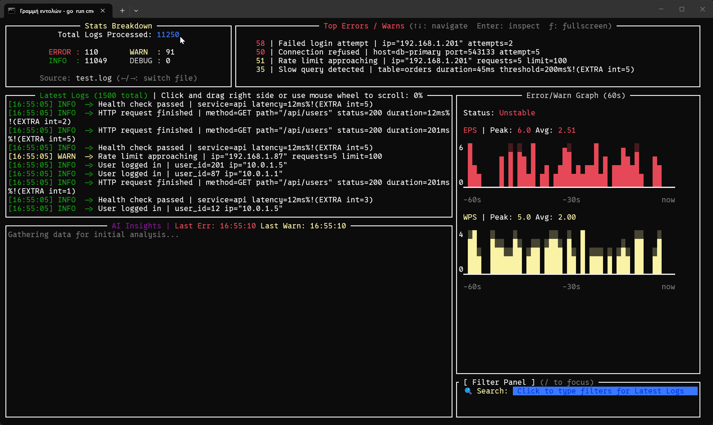
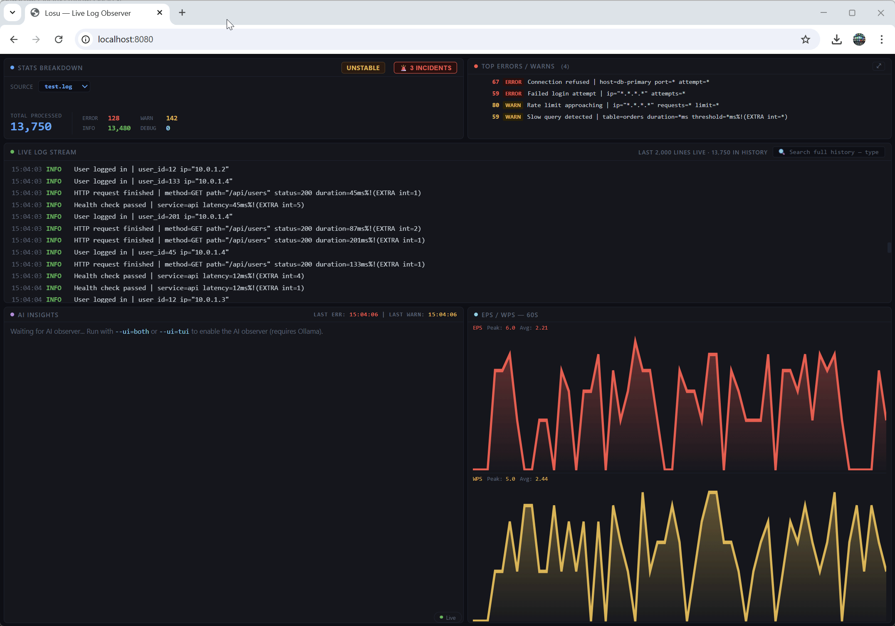

# 🐺 LOSU (Log Observer & Summary Unit)
 
**LOSU** is a high-performance, zero-dependency log tailing + intelligent analysis tool built in Go.  
It turns noisy log streams into actionable SRE intelligence — delivered straight to your terminal, browser, **and pocket**.
 
## 🚀 What LOSU Actually Does 
 
LOSU monitors application logs in real time and:
- detects errors and anomalies instantly
- groups similar issues automatically
- sends alerts to your phone or desktop
- suggests possible root causes (optional AI)
- creates incident reports
- serves a live web dashboard at `localhost:8080`
 
It helps developers debug production systems faster

## Preview!

<div align="center">
  
  <p><em>TUI Dashboard — fully keyboard navigable, works over SSH(tested on Playingfield)</em></p>
  
  <br/>
  
  
  <p><em>Web Dashboard — real-time WebSocket, accessible at :8080</em></p>
</div>
 
## ✨ Highlights
 
- Single static Go binary — **no runtime dependencies**
- **Multi-file monitoring** — watch multiple log files simultaneously, switch between them instantly in both TUI (Tab) and web (dropdown)
- Real-time TUI dashboard with sparkline EPS/WPS graphs
- **Built-in web dashboard** — React UI served from the binary, no Node.js required
- Intelligent log pattern fingerprinting & clustering
- **Two-level forensic drill-down** — per-variant hit timelines for every error cluster
- Optional **local AI root-cause analysis** (Ollama + Llama 3 / Phi-3)
- Mobile heartbeat summaries via **ntfy.sh**
- Desktop notifications via **beeep**
- Smart alert rate-limiting to prevent fatigue
- Memory-safe, high-concurrency pipeline

 
## 🚀 Key Features
 
### Core Monitoring
- **Dynamic pattern grouping** — turns millions of near-identical log lines into clean, readable clusters
- Real-time **60-second sparkline** showing independent **EPS** (Errors/sec) and **WPS** (Warns/sec)
- **Error-first prioritization** — most frequent ERROR always surfaces as "Top Issue"
- **Configurable alert thresholds** via env vars — tune to your app's normal baseline without recompiling
- **Pre-Incident Warning states** — catches warn spikes before errors arrive (`⚠ Pressure Building`, `⚠ Suspicious Activity`, `⚠ Pre-Incident Warning`)
- Zero-data / low-activity awareness with clear delta counters (Errors, Warnings, Info)
- **Malformed Log Protection** — automatically truncates extreme log lines (>1000 chars) to ensure UI responsiveness and prevent memory spikes from "chatty" services
 
### 🌐 Web Dashboard (localhost)
 
LOSU includes a built-in web dashboard served directly from the binary — no Node.js, no npm, no separate assets.
 
```bash
./losu --ui=web    # web only, open http://localhost:8080
./losu --ui=both   # TUI + web simultaneously from the same binary
./losu --ui=tui    # terminal only (default, full backward compatibility)
```
 
**Dashboard Panels:**
- **Stats Breakdown** — total processed, ERROR/WARN/INFO/DEBUG counts, live health status badge
- **Top Errors/Warns** — top 10 clustered patterns, clickable for forensic drill-down
- **Live Log Stream** — real-time feed with search/filter and drag-to-scroll
- **EPS / WPS Graph** — independent 60-second area charts, log-scale so spikes stay visible at high throughput
- **AI Insights** — live AI analysis panel, synced from the same observer that powers the TUI
 
**Two-Level Error Inspector:**
 
Click any row in the Top Errors panel to open a forensic drill-down:
- **Level 1** — all unique variants for that pattern, sorted by hit count, with most-recent hit timestamp
- **Level 2** — click any variant to see its full per-variant hit timeline — distinguish active attacks from one-off failures instantly
 
> The entire frontend is a single HTML file embedded in the binary via `go:embed`. Deploying LOSU with a web UI is identical to deploying without one — copy the binary, run it.
 
### 📁 Multi-File Monitoring

LOSU can watch multiple log files simultaneously — each with fully isolated stats, independent EPS/WPS, and separate incident history.
```env
LOSU_LOG_PATH=./logs/app.log,./logs/worker.log,./logs/payments.log
```

Each file gets its own aggregator, tailer, parser, and pipeline. Switching between files is instant:

- **Web** — dropdown appears in the Stats Breakdown panel when >1 file is active. Selecting a file swaps the entire dashboard view within 500ms.
- **TUI** — press `Tab` to cycle through files. Source name shown in the Stats panel.
- **Incidents** — each incident report is tagged with its source file. The incident viewer filters automatically when you switch sources.

> Auto-detection runs independently per file — you can mix JSON and logfmt logs in the same LOSU instance.

### Executive Heartbeat (SRE Reporting)
LOSU doesn't just tail — it **summarizes system health** and pushes concise status reports to your phone.
 
- Configurable reporting window (`LOSU_REPORT_WINDOW`)
- **Error-first "Top Issue"** promotion
- Counts + delta over the window
- Beautiful, emoji-enhanced mobile notifications via **ntfy.sh**
 
### 🧠 Optional AI Layer ("Pluggable Brain")
If a local Ollama instance is available:
 
- Dedicated "SRE Take" section in heartbeat, TUI, and web dashboard
- Root-cause hypothesis + concrete mitigation suggestions  
  (e.g. "Redis connection pool exhaustion — flush + increase max connections")
- Fully local, private, zero-cost, offline
- AI observer runs independently of UI mode — results are shared between TUI and web from a single analysis source
 
When AI is unavailable → falls back gracefully to statistical summaries.
 
### Forensic Incident Guard 
LOSU acts as an automated SRE that never sleeps. When a system-wide anomaly is detected, it freezes the state for post-mortem analysis.
 
- **Automated Anomaly Snapshots**: Detects 3x traffic spikes or ERROR storms and immediately dumps a "Forensic JSON" to disk.
- **Crime Scene Context**: Each report captures 30,000 lines of data, including:
    - `signal_history`: A filtered view of the exact errors that triggered the spike.
    - `full_context`: The raw system state leading up to the crash.
    - `hourly_trend_errors` / `hourly_trend_warns`: Independent 1-hour trend arrays for errors and warns — distinguishes "error spike" from "warn buildup that preceded errors."
- **Non-Blocking I/O**: Snapshots are serialized and written in a background goroutine, ensuring zero impact on your monitoring latency.
 
### Alerting
- **Desktop** — native OS notifications (`beeep`)
- **Mobile** — instant push via `ntfy.sh` (no account needed)
- **Smart cooldown** — 20-second per-pattern rate limit
 
## 🛠 Tech Stack
 
- **Language**: Go (Golang)
- **TUI**: `tview` + `tcell`
- **Web UI**: React 18 + `htm` (via CDN, no build step) + pure SVG charts, served via Echo + `go:embed`
- **AI**: Ollama (local HTTP API)
- **Notifications**: `beeep` (desktop), `ntfy` (mobile/HTTP)
- **Concurrency**: context-aware worker pools, atomic counters, mutex snapshots, bounded channels
 
## ⚙️ How It Works
 
Losu operates as a high-throughput pipeline designed to bridge the gap between "noisy" raw logs and "actionable" AI insights.
 
1. **Structured Ingestion**: The `Tailer` package utilizes OS-level signals to follow log files, passing data to a `Regex Parser` that extracts Timestamps, Levels, and Messages.
2. **State Aggregation**: The `Aggregator` maintains a thread-safe global state, calculating independent EPS and WPS metrics and clustering similar log patterns via cryptographic-style fingerprinting.
3. **Asynchronous Analysis**: A dedicated `Observer` routine periodically snapshots the aggregator state and prompts a local **Ollama** instance to perform root-cause analysis without blocking the UI. Results are stored in the aggregator and consumed by both TUI and web UI simultaneously.
4. **Reactive TUI**: Built with `tview`, the interface provides a real-time dashboard with interactive search filtering, mouse support, and independent EPS/WPS sparkline graphs.
5. **Web Dashboard**: An Echo HTTP server serves a self-contained React dashboard embedded in the binary. A 500ms WebSocket broadcaster fans out `WebSnapshot` payloads to all connected clients via a non-blocking hub.
6. **Incident Orchestration**: A background "Observer" monitors the delta between the rolling hourly average and current EPS. If a threshold is crossed, it triggers a `sync.WaitGroup`-protected writer that flushes a forensic snapshot to disk, ensuring data integrity even during a forced shutdown.
 
## 🚀 Extreme Performance & Stress Testing
 
The following metrics were captured during an intensive **50,000,000+ log** continuous stress test.
 
### 📊 50,000,000+ Log Benchmark (v1.1 Ultra-Stable)
* **Total Logs Processed**: 50,741,750 (and climbing)
* **Throughput**: 50,000+ EPS (Events Per Second) sustained
* **Peak Intensity**: 452.9 Err+Warn/s (Extreme Log-Bomb Simulation)
* **Memory Footprint**: **~41.6 MB** (Flat-line Steady State)
* **CPU Usage**: Minimal overhead on modern kernels even during 50k EPS spikes.
 
### 🛠️ Optimization Highlights
To achieve "Zero-Overload" on host servers, LOSU utilizes several advanced Go-specific optimizations:
 
* **GPU-Accelerated Rendering**: Optimized for high-speed terminal emulators (like Alacritty), offloading text UI composition to the GPU to prevent ANSI fragmentation ("Symbol Walls").
* **UI Decoupling & Throttling**: Utilizes a 100ms-500ms asynchronous UI refresh ticker, shielding the display from backend ingestion tsunamis and preventing terminal buffer saturation.
* **O(1) Memory Architecture**: Aggregator history uses fixed-cap circular buffers and `sync.Pool` allocation patterns, ensuring RAM usage remains flat regardless of total log volume.
* **Snapshot Concurrency**: State is captured via non-blocking snapshots, allowing the UI to render a consistent view of millions of logs without ever pausing the ingestion pipeline.
* **Bandwidth-Safe WebSocket Stream**: The `WebSnapshot` payload caps sample logs at 50 events and strips timestamp arrays, ensuring the web dashboard never becomes a bottleneck even at 50k EPS.
 
### ⚖️ Resource Stability (The "Flat-Line" Profile)
| Metric | 1M Logs | 25M Logs | 50M+ Logs |
| :--- | :--- | :--- | :--- |
| **RAM Usage** | 31.0MB | 49.8MB | **41.6MB** |
| **Throughput** | 50k EPS | 50k EPS | 50k EPS |
| **UI Latency** | <1ms | <1ms | <1ms |
| **Search Speed** | Instant | Instant | Instant |
 
> **The "Constant-Space" Guarantee**: LOSU's memory profile is **State-Independent**. Whether it has processed 1,000 logs or 100,000,000 logs, the heap remains stabilized (typically under 50MB). This makes it the safest choice for low-spec production nodes, sidecar containers, and mission-critical infrastructure monitoring.
 
## 📦 Installation, Setup and Testing!

<details><summary><b>The Docker Way!</b> (Click to expand)</summary>

Follow these steps to get the monitor and the AI engine running.

### 1. Clone the repository
```bash
git clone https://github.com/nelfander/losu.git
cd losu
```

### 2. Configure your environment
```bash
cp .env.example .env
```
Open `.env` and set:
- `LOG_PATH_HOST` — the folder on your machine containing your log files (e.g. `./logs`)
- `LOSU_LOG_PATH` — path(s) inside the container, comma-separated for multi-file (e.g. `./logs/app.log,./logs/worker.log`)
- `LOSU_NTFY_TOPIC` — your unique ntfy.sh topic for phone alerts

### 3. Spin up the infrastructure
```bash
docker-compose up -d
```
This starts LOSU and the Ollama AI engine in the background.
The web dashboard is immediately available at **http://localhost:8080**

### 4. Prepare the AI (One-Time Setup)
Download the Llama3 model into your local Docker volume. Only needed once:
```bash
docker-compose exec ollama ollama pull llama3
```

### 4b. Mobile Alerts Setup
1. Download the **ntfy** app (iOS/Android)
2. Click **"Subscribe to topic"** and enter a unique private name (e.g. `losu-monitor-5437`)
3. In `.env`, set:
```env
LOSU_NTFY_TOPIC=losu-monitor-5437
LOSU_ALERT_EPS_THRESHOLD=1.0
```
4. Phone alerts fire when EPS is at or above `LOSU_ALERT_EPS_THRESHOLD` — prevents spam from occasional single errors.


### 5. Launch the TUI
In a terminal window:
```bash
# Full dashboard (TUI + web)
docker exec -it losu ./losu --ui=tui

# TUI only
docker exec -it losu ./losu --ui=tui

# Web only (dashboard already running at :8080)
docker exec -it losu ./losu --ui=web
```
To detach from TUI without stopping: `Ctrl+P` then `Ctrl+Q`

### 🛠️ Useful Commands

| Action | Command |
| :--- | :--- |
| **View logs** | `docker logs losu --tail=50` |
| **Shutdown all** | `docker-compose down` |
| **Restart LOSU** | `docker-compose restart losu` |
| **Reset stats** | `docker exec -it losu ./losu --reset` |
| **Check Ollama models** | `docker exec -it losu-ollama ollama list` |

</details>

---

<details><summary><b>The Go Way!</b> (Click to expand)</summary>

### 1. Clone the repository
```bash
git clone https://github.com/nelfander/losu.git
cd losu
```

### 2. Prerequisites
Install [Ollama](https://ollama.com) and pull the Llama 3 model:
```bash
ollama pull llama3
```

### 3. Configuration
Copy `.env.example` to `.env` and fill in your values:

| Environment Variable | Description | Default |
| :--- | :--- | :--- |
| `LOSU_LOG_PATH` | Comma-separated log file paths to monitor | `./logs/app.log` |
| `LOSU_MIN_LEVEL` | Minimum severity (DEBUG/INFO/WARN/ERROR) | `INFO` |
| `LOSU_NTFY_TOPIC` | Unique ntfy.sh topic for phone alerts | `losu-monitor-default` |
| `LOSU_ALERT_EPS_THRESHOLD` | EPS threshold to trigger phone alerts | `1.0` |
| `LOSU_AI_MODEL` | Ollama model for analysis | `llama3` |
| `LOSU_WEB_ADDR` | Web dashboard listen address | `:8080` |
| `LOSU_EPS_MINOR` | EPS threshold → Minor Issues status | `0.1` |
| `LOSU_EPS_WARN` | EPS threshold → Unstable status | `1.0` |
| `LOSU_EPS_CRITICAL` | EPS threshold → Critical Spike status | `5.0` |
| `LOSU_WPS_PRESSURE` | WPS threshold → Pressure Building status | `50` |
| `LOSU_WPS_SUSPICIOUS` | WPS threshold → Suspicious Activity status | `100` |
| `LOSU_WPS_PREINCIDENT` | WPS threshold → Pre-Incident Warning status | `200` |
| `LOSU_REPORT_WINDOW` | Heartbeat report interval in minutes | `60` |

### 4. Mobile Alerts Setup
1. Download the **ntfy** app (iOS/Android)
2. Click **"Subscribe to topic"** and enter a unique private name (e.g. `losu-monitor-5437`)
3. In `.env`, set `LOSU_NTFY_TOPIC` to match:
```env
LOSU_NTFY_TOPIC=losu-monitor-5437
```
4. Set `LOSU_ALERT_EPS_THRESHOLD` to control when your phone rings — default `1.0` means phone alerts only fire when errors are sustained, not for a single occasional error.

### 5. Run the app

```bash
# TUI only (default)
go run cmd/logsum/main.go

# Web dashboard only — open http://localhost:8080
go run cmd/logsum/main.go --ui=web

# Both TUI and web simultaneously
go run cmd/logsum/main.go --ui=both

# Wipe previous session stats and start fresh
go run cmd/logsum/main.go --reset
```

### 6. 🧪 Testing with generators
Run these in separate terminals to simulate real log traffic:
```bash
# Terminal 1 — logfmt traffic → logs/test.log
go run bin/generators/normal/main.go

# Terminal 2 — JSON traffic → logs/test2.log
go run bin/generators/json/json_gen.go
```

</details>

<details><summary><b>Makefile way!</b>(Click to expand)</summary>
You can use the provided **Makefile** for easy execution:

```bash
# Run the monitor (TUI only)
make run

# Run with web dashboard only
make run-web

# Run with both TUI and web dashboard
make run-both

# Wipe stats and start fresh
make run-reset
```

### 6. 🧪 Testing
- <b>Normal logfmt traffic</b>
```bash
make test-normal
```
- <b>JSON / Docker format traffic</b>
```bash
make test-json
```
- <b>Full test suite with race detector</b>
```bash
make test
```
</details>

</details>

---

## ⌨️ Keyboard Shortcuts

LOSU is fully usable over SSH without a mouse.

| Key | Action |
| :--- | :--- |
| `Tab` | Cycle focus: Stats → Top Errors → Logs → Search → Stats |
| `Shift+Tab` | Reverse cycle |
| `←` / `→` | Switch log file (Stats panel, multi-file only) |
| `↑` / `↓` | Navigate rows in Top Errors panel |
| `PgDn` / `PgUp` | Fast scroll (10 rows Top Errors, 20 rows Logs) |
| `Enter` | Open forensic drill-down for highlighted error |
| `f` | Fullscreen Top Errors panel |
| `/` | Jump to search from anywhere |
| `Esc` / `q` | Close any popup |
| `Ctrl+C` | Quit |
 
---
 
## 🏗️ Architecture & Performance Design
 
LOSU is engineered for high-throughput environments using a decoupled, concurrent data pipeline and a "Flat-Line" memory profile.
 
### 1. System Topology & Responsibilities
The application is divided into specialized modules to ensure a clear **Separation of Concerns**.
 
| Component | Package | Responsibility |
| :--- | :--- | :--- |
| **The Watcher** | `/internal/watcher` | **Signal**: Monitors file changes via `fsnotify` and emits non-blocking update signals. |
| **The Tailer** | `/internal/tailer` | **I/O**: Reacts to signals to stream newly added raw bytes into a results channel. |
| **The Pipeline** | `/internal/pipeline` | **Concurrency**: A worker pool that parallelizes parsing across multiple goroutines. |
| **The Parser** | `/internal/parser` | **Transformation**: Auto-detects log format at startup (JSON, logfmt, bracketed, etc.) and routes each line to the appropriate parser. All parsers implement the `Parser` interface — the pipeline is format-agnostic. |
| **The Aggregator** | `/internal/aggregator` | **State**: A stateful engine that builds real-time metrics, trends, and error cardinality. Also triggers forensic snapshots via `sync.WaitGroup`. |
| **The Hub** | `/internal/hub` | **WebSocket**: Non-blocking fan-out hub managing all connected browser clients. Slow clients are dropped rather than stalling the broadcast goroutine. |
| **The Server** | `/internal/server` | **HTTP**: Echo-based server serving the embedded web dashboard and WebSocket stream. Exposes `/ws/stream`, `/api/snapshot`, `/api/inspect`, and `/api/logs`. |
| **The UI** | `/internal/ui` | **Visualization**: A high-performance TUI utilizing atomic buffer rendering for flicker-free display. Two-level keyboard-driven inspector for per-variant forensic drill-down. |
| **The AI** | `/internal/ai` | **Intelligence**: Automated incident analysis and SRE-style reporting via local LLM integration. |
| **The Alerts** | `/internal/alerts` | **Notification**: Rate-limited alerting via Desktop, Mobile (ntfy), or Audio notifications. |
 
### 2. Core Engineering Pillars
The architecture maintains **State-Independent Resource Usage**, ensuring stability regardless of log volume or uptime.
 
#### 🔍 Tiered History Strategy
To balance "Deep Forensics" with "Low RAM," LOSU utilizes a three-tier memory architecture:
* **Tier 1 (UI)**: A 1,500-line virtualized window for real-time rendering.
* **Tier 2 (Forensics)**: A 50,000-line circular buffer for on-demand incident reports and full-history search.
* **Tier 3 (Signals)**: A dedicated 10,000-line high-priority buffer that isolates WARNINGS and ERRORS from the background "INFO" noise.
 
#### ⚡ Persistent Buffer Pooling
To eliminate the overhead of Go's Garbage Collector (GC), the UI does not create new strings for every frame.
* **The Tech**: Uses a persistent `strings.Builder` with `Reset()` and `Grow()`.
* **The Result**: Memory is recycled instead of re-allocated, dropping UI churn by ~60% in high-velocity environments.
 
#### 🧊 Atomic Viewport Rendering
Traditional TUI updates often suffer from "Screen Tearing" or "ANSI Fragmentation" when processing thousands of updates per second.
* **The Tech**: LOSU utilizes a double-buffered rendering approach, where a full frame is constructed in memory and pushed to the terminal in a single `SetText` operation.
* **The Result**: 100% flicker-free UI and zero "Symbol Wall" artifacts, even during 50KB+ log bursts.
 
#### 🛡️ Hard-Capped Cardinality & History
The internal Aggregator uses a "Guard Rail" system to prevent memory leaks from unique log messages.
* **The Tech**:
    * **Message Tracking**: Top-10 lists are limited to the most frequent occurrences.
    * **Log History**: The internal cache is hard-trimmed to the latest 1,500 visible lines.
* **The Result**: RAM usage stays under 30MB whether you have processed 1,000 logs or 10,000,000 logs.
 
#### 🌐 Bandwidth-Safe WebSocket Architecture
The web dashboard must never become a bottleneck for the ingestion pipeline.
* **The Tech**: A dedicated `WebSnapshot` type is served at 500ms intervals, capping sample logs at 250 events and stripping timestamp arrays from `MessageStat`. A non-blocking hub with per-client buffered channels (8 slots) drops slow clients rather than stalling the broadcaster.
* **The Result**: Adding a browser tab to a running LOSU instance has zero measurable impact on TUI performance or ingestion throughput.
 
#### 🔎 Two-Tier Log Search
The web log panel operates in two distinct modes to balance real-time visibility with deep forensic access.
* **The Tech**: Live mode streams a rolling 2,000-line buffer from the WebSocket. Search mode fires a debounced `GET /api/logs` request against the full 50,000-entry history ring in the aggregator — a single reverse-scan pass with no additional allocations on the hot path.
* **The Result**: Users see live traffic instantly and can search the full history of the last 50,000 log events on demand, with results returning in milliseconds.
 
#### 🧬 Format-Agnostic Parser Pipeline
LOSU supports multiple log formats without any changes to the ingestion pipeline.
* **The Tech**: All parsers implement a single `Parser` interface. `DetectParser()` samples the first 10 lines of the log file at startup and uses majority vote to select the appropriate implementation — currently `JSONParser` or `RegexParser`. The pipeline calls `p.Parse(rawLine)` and is entirely format-agnostic.
* **The Result**: Switching from logfmt to JSON logs (or any future format) requires zero configuration changes — LOSU detects and adapts automatically at startup.
 
---
## 🧪 Testing

<details>
<summary>Click to expand testing section</summary>

LOSU's test suite is designed around the actual failure modes of a high-throughput observability tool — race conditions under load, goroutine leaks, data loss at 50k EPS, and silent clustering bugs. Every package has dedicated tests that run with the Go race detector enabled.

```bash
go test -race ./...
```

### 🧩 Aggregator — `go test -race -v ./internal/aggregator/...`

The aggregator is the stateful core of LOSU. Tests verify correctness under concurrent load, incident trigger logic, and the fingerprint clustering engine(50+ cases).

* **Concurrency & Race Safety:** `TestAggregatorConcurrency` runs 50 writer goroutines (50,000 log events) against 50 simultaneous reader goroutines (UI snapshots). Verifies zero data loss and no race conditions under the Go race detector.
* **Incident Trigger Logic:** `TestIncidentTrigger` validates the full spike-detection pipeline — builds a baseline `AverageEPS`, fires a 10x spike, and asserts a forensic JSON file is written to `incidents/` within 3 seconds.
* **Fingerprint Engine (57 cases):** `TestFingerprint` is a table-driven test covering every pattern class the engine encounters in production:
  * Dynamic values replaced: IPs (`ip=*.*.*.*`), ports, durations, PIDs, UUIDs, hex addresses (`0x*`)
  * Product names preserved: `S3`, `HTTP2`, `OAuth2`, `IPv4`, `md5sum`, `sha256`
  * Separator-aware: `user_id=503` → `user_id=*`, `size=2048bytes` → `size=*bytes`
  * Version strings preserved: `TLSv1`, `E11000`, `user123` (digit follows letter → kept)
* **Grouping & Variant Preservation:** `TestGroupingAndDetailPreservation` confirms that `S3 upload failed | id=101` and `id=102` cluster under one pattern while preserving both variants in `VariantCounts`.
* **Circular Buffer Stability:** `TestCircularBufferStability` pushes 50,010 events into a 50,000-cap ring buffer and asserts the oldest 10 were evicted in order — verifying the O(1) constant-space guarantee.
* **Benchmark:** `BenchmarkAggregatorUpdate` measures per-event throughput with the race detector off.

### 🔍 Parser — `go test -race -v ./internal/parser/...`

The parser package handles all log format detection and transformation. Tests cover three implementations and the auto-detection logic.

* **Logfmt Fast-Path:** `TestRegexParser_LogfmtFastPath` verifies manual string slicing correctly extracts level, message, and real `time=` timestamps — not `time.Now()` fallbacks.
* **Brackets Fast-Path:** `TestRegexParser_BracketsFastPath` confirms `[ERROR]` style logs parse correctly and the `knownLevels` guard prevents false positives (e.g. `[section]` in documentation strings).
* **Catch-All Fix:** `TestRegexParser_CatchAll` verifies the subgroup length bug fix — unrecognised lines now return `UNKNOWN` instead of silently falling through.
* **JSON Parser (13 cases):** `TestJSONParser_StandardFields` verifies all field name conventions (`level`/`severity`/`lvl`, `msg`/`message`, `time`/`timestamp`/`ts`/`@timestamp`). Edge cases cover empty objects, malformed JSON, non-JSON lines, and extra field preservation (`status=200 | duration=663` appended to message).
* **Auto-Detection:** `TestDetectParser_*` verifies majority-vote format detection across all-JSON, all-logfmt, mixed (7/10 JSON → picks JSON), empty file, and non-existent file scenarios. The 5-second retry loop is exercised directly.

### 📡 Tailer — `go test -race -v ./internal/tailer/...`

The tailer's correctness is critical — a bug here means silently dropping logs at any throughput.

* **Basic Ingestion:** `TestTailer_BasicIngestion` writes a line and signals the watcher — verifies the line arrives on the results channel within 500ms.
* **Polling Fallback:** `TestTailer_PollingFallback` writes without signalling the channel — verifies the 100ms internal ticker (the "Windows Kick") picks up the data anyway.
* **Graceful Shutdown:** `TestTailer_Shutdown` cancels the context and verifies `Run()` returns `context.Canceled` — no goroutine leak.
* **Empty Line Filtering:** `TestTailer_EmptyLinesFiltered` writes `\n\n\nHello\n` and asserts only 1 result arrives — blank lines never reach the aggregator.
* **Whitespace Trimming:** `TestTailer_WhitespaceTrimming` verifies `"  Hello  \n"` arrives as `"Hello"`.
* **Source Field:** `TestTailer_SourceField` verifies `RawLog.Source` is set to the file path — required for multi-file support.
* **Multi-Line:** `TestTailer_MultipleLines` writes 3 lines atomically and asserts all 3 arrive in order.
* **Non-Existent File:** `TestTailer_NonExistentFile` verifies `Run()` returns an error immediately rather than hanging.

### 👁️ Watcher — `go test -race -v ./internal/watcher/...`

* **Lifecycle:** `TestFSWatcher_Lifecycle` writes to a watched file and verifies a signal arrives within 1 second. Also verifies 5 rapid writes don't block or panic.
* **Invalid Path:** `TestFSWatcher_InvalidPath` confirms `Watch()` returns an error for non-existent paths.
* **Context Cancellation:** `TestFSWatcher_CancelStopsNotifications` cancels the context, writes to the file, and asserts no further signals arrive — verifying the goroutine exits cleanly.
* **Flood Coalescing:** `TestFSWatcher_FloodCoalescing` sends 10 rapid writes and asserts at most 1 signal is buffered — the non-blocking send keeps the channel at capacity 1 regardless of write volume.

### ⚙️ Pipeline — `go test -race -v ./internal/pipeline/...`

* **Multi-Worker Fan-Out:** `TestProcess_MultiWorkerFlow` feeds 100 events through 5 workers and asserts all 100 arrive at the output channel with zero data loss. Verifies the `WaitGroup` lifecycle.
* **Context Cancellation:** `TestProcess_ContextCancel` cancels before sending data and verifies workers exit before processing anything.
* **Output Content:** `TestProcess_OutputContent` verifies the transformed `LogEvent` contains the correct message and level.
* **Source Preservation:** `TestProcess_SourcePreserved` verifies `RawLog.Source` passes through the pipeline to `LogEvent.Source` — critical for multi-file log support.

### 🌐 Hub — `go test -race -v ./internal/hub/...`

The WebSocket hub is the backbone of the web dashboard. These tests use `httptest.NewServer` to run real WebSocket connections without any external infrastructure.

* **Single Client Delivery:** `TestHub_BroadcastReachesClient` connects one browser tab and verifies the payload arrives intact.
* **Fan-Out:** `TestHub_BroadcastReachesAllClients` connects 3 simultaneous clients and asserts all 3 receive identical payloads.
* **Disconnect Handling:** `TestHub_ClientDisconnect` closes a client mid-session and verifies subsequent broadcasts don't panic.
* **Non-Blocking Broadcast:** `TestHub_NonBlockingBroadcast` fires 100 rapid broadcasts with no clients connected and verifies none block — the non-blocking select is the safety valve.
* **Slow Client Dropped:** `TestHub_SlowClientDropped` connects a frozen client (never reads) alongside a healthy one. After flooding past the 8-slot buffer, verifies the healthy client still receives messages — the slow client didn't stall the broadcaster.

### 🔔 Alerts — `go test -race -v ./internal/alerts/...`

* **Cooldown:** `TestAlerts_Cooldown` fires two identical alerts within 500ms and asserts `LastSent` is not updated on the second — the cooldown gate is working.
* **Race Condition:** `TestAlerts_RaceCondition` fires 10 concurrent `Trigger()` calls under the race detector — verifies the mutex correctly protects `LastSent`.
* **Level Isolation:** `TestAlerts_LevelIsolation` triggers both ERROR and WARN and asserts 2 distinct cooldown keys exist — they never share state.
* **Log File Written:** `TestAlerts_LogFileWritten` asserts the log file is created, contains the message, and the first trigger writes `NOTIFIED` status.
* **Cooldown Reset:** `TestAlerts_CooldownResetAfterExpiry` waits past the cooldown window and verifies `LastSent` advances on the next trigger.
* **Empty Topic Skip:** `TestAlerts_EmptyNtfyTopicSkipsPhone` verifies `SendToPhone` returns immediately when `NtfyTopic` is empty — no network call made.

### 🤖 AI — `go test -race -v ./internal/ai/...`

AI tests use `httptest.NewServer` to mock the Ollama API — no running LLM required.

* **Default Configuration:** `TestNewExplainer_Defaults` verifies sensible fallbacks when no env vars are set.
* **Env Override:** `TestNewExplainer_EnvOverride` verifies custom model and host are respected.
* **Docker Host Override:** `TestNewExplainer_DockerHostOverride` verifies `http://ollama:11434` is automatically replaced with `localhost` when running outside Docker.
* **Unreachable Endpoint:** `TestAnalyzeSystem_HTTPError` and `TestAnalyzeHeartbeat_HTTPError` verify both analysis functions return errors gracefully — the app never crashes when Ollama is offline.
* **Mock Server Round-Trip:** `TestAnalyzeSystem_MockServer` and `TestAnalyzeHeartbeat_MockServer` verify the full HTTP request/response cycle — correct JSON payload sent, response correctly decoded.

### 🖥️ UI — `go test -race -v ./internal/ui/...`

TUI logic tests operate on pure Go state — no terminal or tview application required.

* **Filtering (4 cases):** Verifies substring match, level match, empty filter (all pass), and case-insensitive matching.
* **Buffer Management:** Verifies the 1,500-line hard trim fires above the limit and does not fire below it.
* **Truncate (4 cases):** Table-driven — long string trimmed with `...`, short string unchanged, exact limit unchanged, one-over trimmed.
* **Status Label (9 cases):** Covers all 9 health states including the critical "error takes priority over warn" ordering.
* **AI Summary (4 cases):** Verifies error/warn separation, empty snapshot fallback, and the top-3 cap.
* **Sparkline:** Verifies empty data, all-zeros, and single-spike rendering without panicking.

</details>

---

## 🛠 <b>Development History</b>
<details><summary>(Click to expand)</summary>

<details>
<summary><b>April 17, 2026: Graph Bug Fix, Time Axis, AI Fixes, Docker Log Parser & Launch Prep</b> (Click to expand)</summary>
#### Phase 1: Graph Corruption Fix (sparkline.go + update.go)
 
The most important fix of the day. After ~55-60 seconds of runtime the graph panel would corrupt — Braille/block characters would render as scattered dots and the layout would break. Root cause identified: the sparkline was rendering exactly 60 characters wide regardless of the actual panel width. When the 60th data point arrived it overflowed the right border, causing tview to wrap the line and corrupt the internal render state.
 
**Fix:** `GetInnerRect()` is now called every render tick to get the actual panel width. The sparkline is clamped to `chartWidth = graphWidth - 6` (reserving space for the Y-axis label). `getSparklineLog()` accepts a `maxWidth int` parameter and slices the data to fit. The chart now scrolls as new data arrives instead of overflowing.
 
#### Phase 2: Time Axis (update.go)
 
Added a time axis below each chart showing `-60s` on the left, `-30s` in the middle, and `now` on the right in gray. Both EPS and WPS charts have their own axis. The separator line (`▔`) also now scales to `chartWidth` instead of the hardcoded `25` — it was previously too short.
 
#### Phase 3: AI Text Corruption Fix (main.go)
 
tview interprets `[` and `]` as color tag delimiters. The LLM response frequently contains brackets like `[ERROR]`, `[STATS]`, `[TASK]` which tview tried to parse as color tags, corrupting the render state of the entire application including the graph panel. Fix: replace `[` with `(` and `]` with `)` before passing AI text to `SetText`. Also strip markdown (`**`, `###`) from the AI response before storing — tview doesn't render markdown.
 
#### Phase 4: Docker Log Wrapper Parser Fix (json_parser.go)
 
The Docker container log format wraps every line as `{"log":"<actual line>","stream":"stdout","time":"..."}`. The inner `log` field from the real app was logfmt format (`time=... level=WARN msg=...`), but the JSON parser was re-parsing it as JSON and returning UNKNOWN level. Fix: after extracting the inner line, check if it starts with `{` — if yes re-parse as JSON, if no route through `RegexParser` for correct logfmt level extraction. WARN and ERROR levels now show correctly from Docker container logs.
 
#### Phase 5: AI Interval + Timeout (main.go + explainer.go)
 
* `LOSU_AI_INTERVAL_SECONDS` env var added — controls how often AI analysis runs. Default changed from 30s to 60s to accommodate slow CPU inference.
* `AnalyzeSystem` HTTP timeout bumped from 30s to 120s — llama3 on CPU without GPU can take 60-90 seconds to respond. Previously timed out and showed "offline" incorrectly.
* `AnalyzeHeartbeat` timeout bumped from 20s to 60s.
#### Phase 6: Demo Generator (normal_gen.go)
 
Rebuilt the generator specifically for showcasing LOSU's fingerprinting engine:
- 2 error patterns: `Failed login attempt` and `Connection refused` — both with varying IPs from a fixed pool of 5
- 2 warn patterns: `Rate limit approaching` and `Slow query detected`
- 3 healthy patterns
- Ratios: 98% healthy, 1% warn, 1% error — graph stays sparse and readable
- Fixed IP pool (5 IPs) means Top Errors clusters aggressively — perfect for inspector demo
#### Phase 7: Launch Prep
 
* Recorded `Demo-tui.gif` and `Demo-web.gif` for README
* README Preview section planned: GIFs at top, before feature list
* Repo made public on GitHub
* Tested end-to-end on AWS EC2 with real production Docker container logs
</details>

<details>
<summary><b>April 16, 2026: Docker Support, Alert EPS Threshold, AI Fix & README Update</b> 🐳🚨🤖📖 (Click to expand)</summary>
#### Phase 1: Docker Support
 
* **`Dockerfile`** — clean two-stage build. Stage 1: `golang:alpine` builds a fully static binary with `-ldflags="-s -w"` (strips debug symbols, smaller image). Stage 2: minimal `alpine:latest` runtime with only `ca-certificates`. No generators, no `.env`, no source — just the binary. Default entrypoint is `./losu --ui=both` so web dashboard is always available at `:8080`.
* **`docker-compose.yml`** — complete rewrite against current architecture. All env vars documented with defaults (`LOSU_EPS_MINOR`, `LOSU_EPS_WARN`, `LOSU_EPS_CRITICAL`, `LOSU_WPS_*`, `LOSU_REPORT_WINDOW`, `LOSU_ALERT_EPS_THRESHOLD`). Port 8080 exposed. `LOG_PATH_HOST` mounts host log folder into container. `depends_on: ollama` removed — LOSU starts fine without AI. Ollama marked as optional.
* **`.env.example`** — new file users copy to `.env`. All variables documented with explanations. Docker Compose reads it from the host — secrets never baked into the image.
* **Correct workflow:**
  ```bash
  cp .env.example .env   # configure
  docker-compose up -d   # start LOSU + Ollama
  docker exec -it losu ./losu --ui=tui  # attach TUI
  # web dashboard always at http://localhost:8080
  ```
 
#### Phase 2: Alert EPS Threshold (alerts.go + main.go)
 
* **`alerts.go`** — `Trigger()` signature extended with `currentEPS float64`. Phone alert (ntfy) only fires when `currentEPS >= LOSU_ALERT_EPS_THRESHOLD`. Desktop popup (`beeep`) still fires regardless — it's local and not annoying. `alertEPSThreshold()` reads from env, defaults to `1.0`. This prevents phone spam from occasional single errors while still alerting on real sustained spikes.
* **`main.go`** — fixed a long-standing bug: `notifier.Trigger()` was never actually being called. The old code only updated `lastAlertTime` but never triggered any alert. Now correctly calls `notifier.Trigger(event, fileAgg.AverageEPS)`. Also extended to WARN level. Mutex now unlocked before calling `Trigger` to avoid holding lock during network calls.
#### Phase 3: AI Ollama Fix (explainer.go)
 
* **Root cause found:** `NewExplainer()` was unconditionally overriding `LOSU_OLLAMA_HOST=http://ollama:11434` with `http://localhost:11434`. In Docker, `localhost` means the LOSU container itself — not the Ollama container. So AI was always trying to connect to the wrong address.
* **Fix:** Only fall back to `localhost:11434` when `LOSU_OLLAMA_HOST` is completely empty. When the env var is set (as it always is in Docker via `docker-compose.yml`), use it as-is. AI now works correctly in Docker — verified with `llama3:latest`.
#### Phase 4: README Update
 
* Docker Way section fully rewritten — `.env` setup step added, container name fixed (`losu-losu-1` → `losu`), generators removed, mobile alerts setup added, `--reset` flag fixed (was `-reset`).
* Go Way section updated — generator paths fixed, all new env vars added to table, `NTFY_TOPIC` → `LOSU_NTFY_TOPIC`.
* New **Keyboard Shortcuts** table added — Tab cycling, arrow navigation, `f` fullscreen, `/` search, `PgUp/Dn`, `Enter` inspector, `Esc`/`q` close.
</details>

<details>
<summary><b>April 15, 2026: Keyboard Navigation, Graph Improvements & Performance Fixes</b> ⌨️📊⚡ (Click to expand)</summary>
#### Phase 1: Full Keyboard Navigation (input.go)
 
LOSU is now fully usable over SSH without a mouse — every panel is reachable and navigable via keyboard alone.
 
* **Tab / Shift+Tab — panel focus cycling:** Stats → Top Errors → Logs → Search → Stats. Any panel can be reached with Tab alone. Shift+Tab reverses the cycle. AI and Graph panels also participate — clicking into them no longer traps focus.
* **`/` — jump to search from anywhere:** Global handler in `app.SetInputCapture`. Standard log tool convention — press `/` from any panel to immediately focus the search box.
* **Left / Right arrows on Stats panel — file switching:** Replaces the old Tab-for-files behavior. Left = previous file, Right = next file, wraps around. Frees Tab for panel cycling.
* **Up / Down arrows on Top Errors panel — row navigation:** Moves the highlight between error/warn rows without a mouse. `ScrollToHighlight()` keeps the selected row visible. Works in both the normal panel and the fullscreen overlay.
* **Page Up / Page Down — fast scroll:** 10 rows per press on Top Errors, 20 rows on Logs.
* **Fullscreen overlay keyboard nav:** The `f` fullscreen view now has identical Up/Down row navigation and Page Up/Down — previously only mouse-clickable. Title updated to show `↑↓: navigate | Enter: inspect | PgUp/Dn: scroll`.
* **Initial focus on Stats:** `app.SetFocus(stats)` + `app.ForceDraw()` so keyboard works immediately on launch without requiring a click. Windows Terminal still needs a click (OS limitation) but Linux/SSH works immediately.
* **AI + Graph Tab passthrough:** Both read-only panels now have `SetInputCapture` wired up. Tab moves to Stats, Shift+Tab moves to Search. Clicking AI insights no longer traps the user.
* **Filter panel title hint:** `[ Filter Panel ] (/ to focus)` — self-documenting.
* **Top Errors title hint updated:** `(↑↓: navigate  Enter: inspect  f: fullscreen)`.
* **Source indicator updated:** `(←/→: switch file)` replaces old `(Tab: next file)`.
#### Phase 2: Graph Improvements (sparkline.go)
 
* **Braille characters:** Replaced `█`/`▄` (2 intensity levels per row) with Braille block chars `⣀⣤⣶⣿` (4 intensity levels per row). Curves are visibly smoother on terminals with proper Unicode monospace font support. On Linux/SSH with JetBrains Mono or Fira Code the improvement is significant.
* **Y-axis labels:** Peak value shown top-left, min value bottom-left of each chart. You can now read the actual scale instead of just the shape.
* **Range normalization:** Switched from absolute `(0, max)` normalization to relative `(min, max)` normalization. At high sustained throughput where all values are near the peak, the chart now shows variation within the window rather than a solid wall. Fallback to absolute scale when range < 0.01 (genuinely flat signal) prevents noise amplification.
* **Color parameter:** `color string` passed directly to `getSparklineLog()` — eliminates the post-hoc `strings.ReplaceAll` pass that was rewriting the entire output string on every render tick.
* **Zero heap allocations:** `var scaled [60]float64` is stack-allocated (maxTrend is always 60). Single `strings.Builder` for the whole chart replaces `[]string` + `strings.Join`. Two fewer allocations per 500ms render tick.
#### Phase 3: VariantTimestamps Memory Fix (aggregator.go)
 
* **pprof confirmed root cause:** `&model.VariantTimestamps{}` at aggregator.go:357 was consuming 30MB — a heap allocation for every unique message variant. At 20k logs/sec with high message variety this caused RAM to balloon to 3x baseline.
* **Fix:** Cap `VariantTimestamps` at 50 variants per pattern. `VariantCounts` still increments for all variants (full observability, accurate counts). Only the timestamp ring used by the Level 2 inspector hit timeline is capped. RAM stabilized at ~58MB at 80M+ logs.
#### Phase 4: Stats Panel Polish (update.go)
 
* Removed leading `\n` from stats string — all content visible without scrolling, source line no longer hidden below the fold.
</details>


<details>
<summary><b>April 10, 2026: dashboard.go Split into 5 Files & VariantTimestamps Memory Fix</b> 🏗️🧠 (Click to expand)</summary>
 
#### Phase 1: dashboard.go Refactor — 5-File Split
 
The monolithic `internal/ui/dashboard.go` (~1000 lines) was split into 5 focused files, all in `package ui`. No logic was changed — pure reorganization for readability and maintainability.
 
* **`dashboard.go`** — `Dashboard` struct definition and `NewDashboard()` constructor. Wires together all tview primitives (stats, topErrors, logs, graph, ai, searchInput), builds the flex layout, initializes pages, and delegates all input handling to `input.go` via a single `setupInput()` call. 164 lines.
 
* **`input.go`** — All keyboard and mouse capture handlers. Contains `setupInput()` (called once from `NewDashboard()`), `setupMouseHandlers()` for drag-to-scroll and accelerated mouse wheel on logs and top errors panels, `openTopErrorsFullscreen()` for the `f` key fullscreen overlay, and `openLevel1Inspector()` for the Enter key Level 1 variant list. Also contains Left/Right arrow file cycling on the stats panel (groundwork for keyboard navigation). 466 lines.
 
* **`update.go`** — The `Update()` method called every 500ms with a fresh `model.Snapshot`. Renders stats panel, graph sparklines, top errors list, incremental log stream append, scroll feedback title, and AI insights title. The high-performance double-buffer design (incremental append + single `SetText`) is preserved exactly. 190 lines.
 
* **`inspector.go`** — Forensic drill-down popup logic. Contains `openLevel2Inspector()` which builds the per-variant timestamp timeline content, `ShowVariantInspector()` which renders the Level 2 popup with drag-to-scroll, and `ShowInspector()` kept for backward compatibility. 234 lines.
 
* **`sparkline.go`** — Pure stateless helper functions: `truncate()`, `getSparkline()`, `getSparklineLog()` (log-scale compression), `getStatusLabel()` (EPS/WPS health label with env var thresholds), `getColor()`, and `GetSummaryForAI()`. 208 lines.
 
Each file has a header comment explaining its role and how it fits into the overall architecture.
 
#### Phase 2: VariantTimestamps Memory Fix
 
pprof profiling revealed `&model.VariantTimestamps{}` at `aggregator.go:357` was consuming **30MB** — allocating a heap timestamp ring for every single unique message variant. At 20k logs/sec with high message variety this caused RAM to balloon to 3x the expected baseline.
 
**Fix:** cap `VariantTimestamps` allocation at 50 variants per pattern. `VariantCounts` still increments for all variants (full observability, accurate counts) — only the timestamp ring used by the Level 2 inspector hit timeline is capped. Variants beyond 50 show count but no timestamp history in the inspector.
 
```go
// Before — unbounded allocation:
vt, ok := stat.VariantTimestamps[event.Message]
if !ok {
    vt = &model.VariantTimestamps{}
    stat.VariantTimestamps[event.Message] = vt
}
vt.Push(event.Timestamp)
 
// After — capped at 50:
vt, ok := stat.VariantTimestamps[event.Message]
if !ok && len(stat.VariantTimestamps) < 50 {
    vt = &model.VariantTimestamps{}
    stat.VariantTimestamps[event.Message] = vt
}
if vt != nil {
    vt.Push(event.Timestamp)
}
```
 
RAM dropped back toward the original ~40MB baseline at 20k logs/sec.
 
</details>
 

<details>
<summary><b>April 7, 2026: Errors-First Sorting, No-Cap Top Errors, Stable Tiebreaker, Source Switching Fixes & TUI/Web Expand</b> 🔴📊⤢ (Click to expand)</summary>
 
#### Phase 1: Errors Always First — No Cap on Top Errors
 
* **`aggregator.go` — `getTopMessages()` rewritten:** The function no longer accepts an `n int` cap parameter — it returns all clustered patterns. Sort order is now: (1) ERROR always before WARN regardless of count, (2) count descending within each level, (3) pattern key alphabetically as a stable tiebreaker. The tiebreaker is critical — without it, two patterns with identical level and count would swap positions on every 1-second `PushTrend()` tick, causing visible flickering in both TUI and web. The sort now collects `(stat, patternKey)` pairs so the fingerprint string is available as a deterministic tiebreaker. `PushTrend()` updated from `getTopMessages(10)` to `getTopMessages()`.
* **`dashboard.go` — TUI panel title and rendering:** Panel title updated from `Top 10 Error/Warn Messages` to `Top Errors / Warns`. The fixed 2-column 5-row grid (showing exactly 10) replaced with a single scrollable column rendering all patterns. Message truncation increased from 35 to 70 chars (later to 90). The `StatLookup` slice is now indexed sequentially — no more two-column index math.
 
#### Phase 2: Web Source Switching & "All Files" Removal
 
* **`index.html` — "All Files" option removed:** The source dropdown previously had an "All Files" `<option value="">` entry that showed combined data — which doesn't exist in the architecture (each file has its own isolated aggregator). Removed entirely. The dropdown now only shows actual file sources.
* **`index.html` — `sendMessage` fix:** The previous `_wsRef` module-level variable approach was broken — it was never actually assigned the live WebSocket. `sendMessage` is now returned directly from `useLosuWS()` using `wsRef.current`, which is always the live connection. Source switching now correctly sends `{"type":"set_source","source":"..."}` to the server.
* **`index.html` — Auto-select first source:** `sourcesInitialized` ref prevents repeated auto-selection. On first data load, `sources[0]` is selected and `set_source` is sent to the server so the dashboard immediately shows correct data.
 
#### Phase 3: TopErrorsPanel Expand Button (Web)
 
* **`index.html` — `⤢` expand button:** Added to the `TopErrorsPanel` card header. Shows pattern count `(N)` next to the title. Clicking opens an 860px wide, 85vh modal overlay with the same rows and click-to-inspect functionality — `TopErrorsList` extracted as a shared sub-component used in both the compact card and the expanded overlay. Clicking a row in the expanded overlay opens the Level 1 inspector and closes the overlay automatically. Click outside or `✕` to close.
 
#### Phase 4: TUI Mouse Wheel & Fullscreen (dashboard.go)
 
* **Mouse wheel with acceleration on Top Errors panel:** The existing drag handler only caught `Button1` clicks — scroll events fell through to tview's default single-step scroll. Added `MouseScrollUp`/`MouseScrollDown` handling with the same acceleration logic already used in the variant list inspector: slow scroll = 3 rows, rapid consecutive scrolls (< 120ms apart) build up to 15 rows per tick. `lastTopScrollTime` and `topScrollAccel` track state.
* **`f` key fullscreen:** Pressing `f` while the Top Errors panel has focus opens a full-terminal `TextView` overlay. Content is re-rendered at 150-char truncation (vs 90 in the normal panel) to take advantage of the full terminal width. The fullscreen view has its own accelerated mouse wheel and drag-to-scroll. Pressing `f`, `Esc`, or `q` closes it and returns focus to the Top Errors panel.
* **Enter works in fullscreen:** Highlighting a row and pressing Enter in fullscreen syncs the highlight to `topErrors`, closes the fullscreen, refocuses `topErrors`, then queues an Enter event via `app.QueueEvent` — the Level 1 inspector opens immediately. `SetHighlightedFunc` keeps the highlight in sync as you navigate.
* **Title hint:** Top Errors panel border now shows `[gray](f: fullscreen)` so the shortcut is always discoverable.
* **Truncation:** Normal panel 70 → 90 chars. Fullscreen 150 chars.
 
#### Phase 5: Incident Filtering Per Source
 
* **`aggregator.go` — `Source` field + `NewAggregatorForSource`:** Each aggregator is tagged with the log file path it watches. `TriggerIncidentReport` writes `"source": "..."` as the second JSON field in every incident file.
* **`server.go` — `?source=` filter:** `handleIncidentList` reads the query param and skips incidents whose `partial.Source` doesn't match. No param = all incidents returned.
* **`index.html` — `IncidentModal` re-fetches on source change:** `useEffect` dependency on `activeSource` resets list, resets selection, and re-fetches with `?source=` filter. Incident count badge also re-polls with source filter.
 
#### Phase 6: Generator Reorganization
 
* **`bin/generators/normal/main.go`** — logfmt format, 33 healthy / 18 warn / 18 error templates covering auth, HTTP, DB, cache, S3, workers, payments, system. Writes to `logs/test.log`.
* **`bin/generators/json/json_gen.go`** — JSON format. Writes to `logs/test2.log`.
* Both run simultaneously for multi-file testing.
 
</details>
 

<details>
<summary><b>April 6, 2026: Full Test Suite, Multi-File Support & Per-Source Incident Filtering</b> (Click to expand)</summary>
 
#### Phase 1: Full Test Suite (All Packages, Race Detector)
 
* **Aggregator (57 fingerprint cases):** Table-driven tests cover every pattern class — IPs, hex addresses (`0x*`), product names preserved (`S3`, `HTTP2`, `OAuth2`), separator-aware clustering (`user_id=*`, `img_*`), quoted values, UUIDs, and the `inHexToken` fix that prevented `size=2048bytes` from becoming `size=*ytes`. Concurrency test runs 50 writer + 50 reader goroutines simultaneously under the race detector with zero data loss. `TestIncidentTrigger` builds a real EPS baseline, fires a 10x spike, and asserts a forensic JSON file lands in `incidents/` within 3 seconds.
* **Parser:** Logfmt fast-path, brackets fast-path, catch-all fix. JSON parser tests cover all field name conventions (`level`/`severity`/`lvl`, `msg`/`message`, `time`/`timestamp`/`ts`/`@timestamp`), extra field preservation, malformed input, and all 4 timestamp field names. Autodetect tests verify majority-vote format detection across all-JSON, all-logfmt, mixed ratios, empty file, and non-existent file (5-second retry loop exercised directly).
* **Tailer:** Basic ingestion, polling fallback (Windows Kick), graceful shutdown, empty line filtering, whitespace trimming, source field preservation, multi-line atomic write, non-existent file error.
* **Watcher:** Lifecycle, invalid path, context cancellation stops notifications, flood coalescing (10 rapid writes → at most 1 buffered signal).
* **Pipeline:** Multi-worker fan-out, context cancel, output content verification, source field preserved through pipeline.
* **Hub:** Broadcast delivery, 3-client fan-out, disconnect handling, non-blocking broadcast (100 rapid calls, no block), slow client drop (frozen tab doesn't stall healthy clients).
* **Alerts:** Cooldown gate, race condition (10 concurrent triggers), level isolation (ERROR/WARN tracked independently), log file written with `NOTIFIED` status, cooldown reset after expiry, empty NtfyTopic skips network call.
* **AI:** Default config, env override, Docker host override (`ollama:11434` → `localhost`), unreachable endpoint returns error gracefully, mock server round-trip for both `AnalyzeSystem` and `AnalyzeHeartbeat`.
* **UI:** Filtering (4 cases including case-insensitive), buffer management, truncate (4 cases), status label (9 states including error-overrides-warn), AI summary (4 cases including top-3 cap), sparkline edge cases.
 
#### Phase 2: AnalyzeSystem Signature Update
 
* **Independent EPS/WPS telemetry:** `AnalyzeSystem` signature extended from 4 to 6 parameters — `avgWps float64, peakWps float64` added as 5th and 6th args. The `[TELEMETRY]` section of the prompt now shows errors/sec and warns/sec as separate lines instead of a combined `E+W/sec` metric. The AI can now distinguish a pure error storm from a warn flood — the two most different failure signatures in practice.
 
#### Phase 3: Multi-File Support (Option B — One Aggregator Per File)
 
* **Architectural decision:** Option A (single aggregator, filter by `Source` field at display time) was implemented and found to be broken — `ErrorCounts`, `AverageEPS`, `TopMessages`, and all trend rings were global, so switching source showed identical data. Option B (one independent `*aggregator.Aggregator` per file) is architecturally clean: stats are genuinely isolated, switching is a pointer swap, and the aggregator internals are completely untouched.
* **`main.go`:** `LOSU_LOG_PATH` is split by comma. Each path gets its own `aggregator`, `tailer`, `watcher`, `parser`, `rawLineChan`, `eventChan`, and GOROUTINE A. All are started in a loop. `aggMap map[string]*aggregator.Aggregator` and `aggKeys []string` hold the full set. `activeAgg` is the default (first file).
* **`server.go`:** Constructor now takes `aggMap` instead of a single `*aggregator.Aggregator`. Active aggregator stored as `unsafe.Pointer` and swapped atomically via `atomic.StorePointer` — the broadcaster never blocks on a lock. WebSocket handler starts a read goroutine that listens for `{"type":"set_source","source":"..."}` messages and calls `setActiveAgg()`. Source switch is visible on the next 500ms broadcast tick.
* **`dashboard.go` (TUI):** `ActiveSource string` and `Sources []string` replaced by `ActiveAgg *aggregator.Aggregator`, `AggMap map[string]*aggregator.Aggregator`, and `AggKeys []string`. Tab key cycles through `AggKeys` by index, swaps `ActiveAgg`, and resets the log buffer so mixed history doesn't bleed across. Stats panel shows `Source: app.log (Tab: next file)` when multiple files are active.
* **`index.html` (Web):** `sendMessage` exposed directly from `useLosuWS` hook using `wsRef.current` — the previous `_wsRef` module-level variable approach was broken because it was never actually assigned the live WebSocket. Source switcher uses a native `<select>` dropdown (compact, responsive, never wraps) instead of pill buttons. Selecting a source calls `sendMessage({type: 'set_source', source})` immediately.
 
#### Phase 4: Per-Source Incident Filtering
 
* **`aggregator.go`:** `Source string` field added to `Aggregator` struct. `NewAggregatorForSource(path)` constructor sets it. `TriggerIncidentReport` writes `"source": "..."` as the second field in every incident JSON — old incidents without this field return empty string and appear only in the "All Files" view.
* **`server.go`:** `handleIncidentList` reads `?source=` query param. Any incident whose `partial.Source` doesn't match is skipped. No source param returns all incidents as before.
* **`index.html`:** `IncidentModal` accepts `activeSource` prop. `useEffect` re-runs on `activeSource` change — resets list, resets selected incident, re-fetches with `?source=` filter. The 🚨 incident count badge also re-polls with source filter so it only counts incidents for the active file.
 
#### Phase 5: Generator Reorganization
 
* **`bin/generators/normal/main.go`:** New logfmt generator with 33 healthy templates, 18 warn templates, and 18 error templates. Covers auth, HTTP, database, cache, S3 storage, job queues, payments, and system events. 94%/5%/1% healthy/warn/error ratio. Writes to `logs/test.log`.
* **`bin/generators/json/json_gen.go`:** Existing JSON generator moved to dedicated subdirectory. Reads `LOSU_TEST_LOG_PATH` env var, defaults to `logs/test2.log`.
* Both generators run simultaneously for multi-file testing: `go run bin/generators/normal/main.go` + `go run bin/generators/json/json_gen.go`.
 
</details>

<details>
<summary><b>April 5, 2026: Incident Viewer, Report Intelligence & Fingerprint Hardening</b> 🚨🔬🧬 (Click to expand)</summary>
 
#### Phase 1: Incident Viewer (Web UI)
* **`GET /api/incidents`**: New endpoint that scans the `incidents/` folder and returns a metadata list for each report — filename, timestamp, reason, peak EPS/WPS, total lines, started_at, ended_at. Partially unmarshals each file to extract only the top-level fields, never loading the full 30k-line signal history just for the list view.
* **`GET /api/incidents/:file`**: Returns the full content of a single incident file. Uses `filepath.Base()` to sanitize the filename and prevent path traversal attacks (e.g. `../../etc/passwd`).
* **`IncidentModal` — Split-Pane Layout**: Left panel lists all incidents sorted newest-first (timestamp, reason, peak EPS/WPS, line count). Right panel shows the full detail of the selected incident. Clicking any row in the left panel loads the full report without closing the modal.
* **`SignalHistoryPanel` with Inline Filter**: Signal history is rendered as its own component with a live filter input on the same line as the "Signal History (N events)" header. Filtering is instant — no debounce needed since it operates on already-loaded data. Shows "X of N events" count when filtered, "no results" message when nothing matches. Capped at 500 rendered rows for browser performance.
* **Incident Count Polling**: `App` polls `/api/incidents` every 10 seconds. A red `🚨 N INCIDENTS` button appears in the Stats Breakdown header as soon as the first incident file is written — no page reload required.
* **`incidents/` Folder**: Incident reports now write to `incidents/incident_YYYY-MM-DD_HH-MM-SS.json` instead of the project root. `os.MkdirAll("incidents", 0755)` ensures the folder is created automatically on first report.
 
#### Phase 2: Incident Report Intelligence
* **Monitoring Window (started_at / ended_at)**: Each incident JSON now includes the full monitoring window it covers — from when the previous incident ended (or LOSU start time for the first incident) to when the anomaly was detected. This answers "how long were we watching before this fired?" rather than just "when did it happen?". The web UI displays this as `13:17:37 → 13:45:21 (27m 44s window)`.
* **`StartTime` on Aggregator**: Added `StartTime time.Time` to the aggregator struct, set in `NewAggregator()`. Used as the `started_at` fallback for the very first incident when `LastReportTime` is still zero.
* **Window-Filtered Signal History**: `TriggerIncidentReport` now filters `signalHistory` to only events that occurred after `windowStart`. Each report contains only the signals from its own monitoring window — no bleedover from previous incidents. The global `signalHistory` ring is untouched.
* **Smarter `shouldTriggerReport`**: Redesigned with three priority levels: (1) Critical/Fatal — 1-minute cooldown, fires repeatedly during sustained critical spikes without flooding; (2) Normal spike — 5-minute cooldown, reset when EPS recovers; (3) Spike detection — current EPS must be above `epsMinimum` AND 3x the rolling average. All thresholds read from env vars.
* **Recovery Reset in `PushTrend`**: Every second, if `AverageEPS` AND `AverageWPS` both drop below `epsMinimum`, `LastReportTime` is reset to zero. This allows the next spike to trigger a fresh report immediately after the system recovers — fixing the "second report never fires" bug.
 
#### Phase 3: Env Var Alignment
* **Consistent Threshold Names**: Aligned all threshold env var names across `dashboard.go`, `aggregator.go`, and `index.html`. Code now reads `LOSU_EPS_WARN` (not `LOSU_EPS_UNSTABLE`) and `LOSU_EPS_CRITICAL` (not `LOSU_EPS_SUSTAINED`) — matching the `.env` file exactly. Removed the redundant `Sustained Errors` status label.
* **`epsMinimum` in `shouldTriggerReport`**: Renamed from `epsFloor` for clarity — the name now immediately communicates "minimum EPS required to trigger a report" without needing a comment to explain it.
* **`getStatus` Web Defaults**: Updated `index.html` `getStatus()` defaults to match `.env` defaults exactly (critical=5.0, warn=1.0). Added comment explaining that these must be updated if `.env` thresholds change.
 
#### Phase 4: Fingerprint Hardening
* **Name-Embedded Digits Preserved**: Rewrote the `fingerprint()` function to track `afterSeparator` state. Digits that follow a separator (`=`, `:`, space, `_`, `.` etc.) are replaced with `*`. Digits that follow a letter are kept — preserving product names like `S3`, version strings like `v2`, protocol names like `HTTP2`, and hash names like `md5`.
* **Underscore as Separator**: `_` moved from `isLetter` to `isSeparator`. This fixes `key=img_340` clustering — `_` resets `afterSeparator=true` so `340` is correctly replaced with `*`, giving `key=img_*`. Previously `_` was treated as a letter so `340` followed a "letter" and was kept, making every unique img key a separate pattern.
* **Timezone Fix**: `fmtTime()` in `index.html` switched from `toISOString().slice(11,19)` (UTC) to `toLocaleTimeString('en-GB', { hour12: false })` (browser local time). Go serializes timestamps as RFC3339 with timezone offset — `toISOString()` was stripping the offset and displaying UTC, showing times 2 hours behind for UTC+2 users.
 
</details>
 

<details>
<summary><b>April 4, 2026: Multi-Format Parsing, Forensic Drill-Down & Full-History Search</b>(Click to expand)</summary>
 
#### Phase 1: Two-Level TUI Inspector (Keyboard-Driven Forensics)
* **`tview.List` Variant Navigator**: Replaced the flat text wall in the TUI inspector with a fully interactive `tview.List`. Each row displays the most recent hit timestamp, hit count, and message for a specific variant — sorted by count descending. Arrow keys navigate, Enter drills down.
* **Level 2 Variant Timeline**: Pressing Enter on any variant opens a second-level `ShowVariantInspector` popup showing the full 20-entry per-variant timestamp history. Esc returns to the Level 1 list rather than closing entirely, making back-navigation feel natural.
* **Accelerated Mouse Wheel Scrolling**: `tview.List` moves one item per scroll tick by default — unusable for 500+ variant lists. Intercepted mouse events via `SetMouseCapture` and implemented velocity-based acceleration: slow scrolling moves 5 items, rapid consecutive ticks build up to 25 items per tick. Returns `nil` for the event to prevent tview's default handler from double-firing.
* **Stable Sort Tiebreaker**: Variants with equal counts are sorted by last-hit timestamp descending, then alphabetically — eliminating the "flickering" where two tied variants swapped positions every 500ms tick.
 
#### Phase 2: Full-History Web Search
* **`SearchHistory()` on the Aggregator**: Added an on-demand method that performs a single-pass reverse scan through the full 50,000-entry history ring. Supports independent `q` (case-insensitive substring) and `level` (exact match) filters with a configurable result cap (default 500). Called only on user input — never on the hot path.
* **`GET /api/logs` Endpoint**: New Echo route accepting `?q=`, `?level=`, and `?limit=` query parameters. Returns a JSON envelope with `results`, `count`, `q`, `level`, and `limit` so the frontend knows exactly what was searched.
* **Debounced Search in `LogPanel`**: The web log panel now operates in two modes — **Live** (rolling 2,000-line WebSocket buffer) and **Search** (static results from full history). A 300ms debounce fires the API call after the user stops typing. Clearing the filter immediately returns to live mode. The status label communicates both modes clearly: `"last 2,000 lines live · 47,832 in history"` and `"76 results from 47,832 logs in history"`.
* **Smart Level Detection**: Typing exactly `ERROR`, `WARN`, `INFO`, or `DEBUG` automatically routes to the level filter rather than substring search — no extra syntax required.
 
#### Phase 3: Timestamp & Display Fixes
* **Timezone Double-Conversion Fix**: Web timestamps were showing 2 hours ahead. Root cause: Go serializes timestamps as RFC3339 with timezone offset (e.g. `+02:00`). JavaScript's `toTimeString()` re-applies the local timezone offset on top, doubling it. Fixed by switching to `toISOString().slice(11,19)` which reads the UTC equivalent without re-converting.
* **Stable Top-Error Display**: The top errors panel was flickering because `getTopVariant()` returned the most common raw message — which flips between tied variants every tick. Fixed by using `getPatternKey()` (the stable fingerprint with `*` placeholders) as the display text. `High memory usage | threshold=*` never changes regardless of which specific threshold value is currently winning.
* **"Ago" Text Removed**: Variant timelines in both the web inspector and TUI now show only the precise timestamp with milliseconds (`17:13:47.000`). "Just now" and "X ago" added noise without adding information — the exact time is more useful for forensic analysis.
 
#### Phase 4: Multi-Format Log Parsing
* **`JSONParser`**: New parser implementing the `Parser` interface for structured JSON logs. Supports field name conventions across all major logging libraries — `level`/`severity`/`lvl` for level, `msg`/`message` for the primary message, `time`/`timestamp`/`ts`/`@timestamp` for the event time. Uses `map[string]json.RawMessage` to defer parsing of fields that aren't needed, avoiding the cost of fully unmarshaling large log objects at 10k+ EPS.
* **Extra Field Preservation**: After extracting `msg`, all remaining JSON fields are appended as `key=value` context (`HTTP request finished | status=200 | duration=663`). This matches the logfmt output format exactly, ensuring the fingerprinter clusters JSON logs correctly without any special-casing.
* **`DetectParser()` with Retry Loop**: Auto-detection samples the first 10 non-empty lines of the log file and uses majority vote (>50% must be JSON) to avoid false positives from files with header blocks. A 200ms retry loop runs for up to 5 seconds to handle the common deployment case where LOSU starts before the application has written its first log line. After 5 seconds, defaults to `RegexParser`.
* **Zero Pipeline Changes**: The `Parser` interface and `pipeline.Process` are untouched. Adding a new format is adding one file — the extension point was already there.
* **JSON Log Generator**: Added `bin/json/json_gen.go` producing structured JSON logs at 10k logs/sec for testing and benchmarking the new parser path.
 
</details>
 
<details>
<summary><b>April 3, 2026: Full-Stack Observability & Web UI Overhaul</b> 🌐🔬⚡ (Click to expand)</summary>

#### Phase 1: Decoupled Signal Architecture (EPS/WPS Split)
* **Separated Error & Warn Signals**: Replaced the single combined `trendRing` with two independent `errorTrendRing` and `warnTrendRing` circular buffers. The old "Err+Warn/s" metric was misleading — a warn flood and an error spike look identical when merged. Now EPS (Errors/sec) and WPS (Warns/sec) are tracked, graphed, and alarmed independently.
* **Dual Forensic Rings**: Extended the 3600-slot incident forensic ring into two (`errorIncidentRing` + `warnIncidentRing`), each tracking a full hour of independent signal history. Incident JSON reports now contain `hourly_trend_errors` and `hourly_trend_warns` separately, enabling post-mortem root cause analysis that distinguishes "error spike" from "warn buildup that preceded errors."
* **Configurable Thresholds via Env**: Replaced all hardcoded EPS/WPS alert thresholds with environment variables (`LOSU_EPS_CRITICAL`, `LOSU_WPS_SUSPICIOUS`, etc.). Each application deployment can tune its own "normal" baseline without recompiling — a payment processor and a game server have fundamentally different error tolerances.
* **Pre-Incident Warning States**: Added warn-based status labels (`⚠ Pressure Building`, `⚠ Suspicious Activity`, `⚠ Pre-Incident Warning`) that surface only when errors are healthy but warns are spiking. This catches the classic incident pattern — warns spike first, errors follow — before the errors actually arrive.

#### Phase 2: Parser Hardening & Timestamp Recovery
* **Package-Level Cleaner**: Moved `strings.NewReplacer` from inside `Parse()` to package scope. The original was re-allocated on every call, defeating its own stated optimization. Now it is truly shared across all parse calls.
* **Fast-Path Timestamp Recovery**: The logfmt and bracket fast-paths previously discarded the real `time=` timestamp and silently substituted `time.Now()`. Fixed both paths to extract and parse the actual timestamp, restoring accurate event timing in `LogEvent.Timestamp`.
* **`catch-all` Pattern Fix**: The catch-all regex only captures 1 group but the loop checked `len(matches) >= 3`, so it never fired — every unmatched line fell through to the bottom fallback silently. Fixed the guard to `len(matches) == 0` and handled the single capture group correctly.

#### Phase 3: Per-Variant Forensic Timestamps
* **`VariantTimestamps` Ring**: Added a 20-slot circular timestamp buffer per unique message variant inside `MessageStat`. At 10-20k logs/sec a hot variant hits 1-5/sec, making 20 entries sufficient to distinguish burst vs sustained patterns while keeping total memory overhead under 1MB across all patterns.
* **Two-Level Drill-Down**: The inspector (both TUI and Web) now supports a two-level click path: Pattern → Variant list (with last-hit time + count) → Variant timeline (full 20-timestamp history for that specific IP/user/key). This turns "Failed login attempt — 412 hits" into forensic-grade data: which IPs are attacking, at what rate, since when.
* **Aggregator `GetInspect()` API**: Added an on-demand `GetInspect(pattern string)` method that returns the full `InspectResult` including per-variant detail. This is only called when a user clicks a row — never included in the 500ms WebSocket stream — keeping the hot path completely unaffected.

#### Phase 4: Web UI (localhost Dashboard)
* **Event Bus & WebSocket Hub**: Introduced `internal/hub` — a non-blocking fan-out hub that manages WebSocket clients. Each client owns a buffered send channel (8 slots). Slow or dead clients are dropped rather than blocking the broadcast goroutine, protecting pipeline throughput.
* **`WebSnapshot` — Bandwidth-Safe Payload**: Defined a separate `WebSnapshot` type served at 500ms intervals. Unlike the full `Snapshot` used by the TUI (which carries 50k `LogEvent` objects), `WebSnapshot` caps sample logs at 50 events, strips timestamp arrays from `MessageStat`, and serializes only what the browser needs to render.
* **Echo HTTP Server with `go:embed`**: The web server (`internal/server`) embeds `index.html` at compile time via `//go:embed static/index.html`. The binary remains fully self-contained — no Node.js, no npm, no separate assets. Running `./losu --ui=web` serves the full dashboard at `localhost:8080` with zero external dependencies.
* **`--ui` Flag**: Added `--ui=tui|web|both` flag. Default is `tui` for full backward compatibility. `--ui=both` runs the terminal dashboard and web server simultaneously from the same binary and the same aggregator state.
* **React via CDN + `htm`**: The frontend uses React 18 and `htm` loaded from CDN — no build step, no compiler, no toolchain. `htm` provides JSX-like syntax in plain JavaScript using tagged template literals. The entire frontend is a single HTML file.
* **Pure SVG Sparklines with Log Scale**: Replaced Recharts (which had CDN loading issues) with hand-rolled SVG area charts. Applied `Math.log1p()` scaling so spikes remain visible at high throughput instead of producing a solid wall of blocks.
* **`/api/inspect` Endpoint**: Added a query-parameter REST endpoint (`GET /api/inspect?pattern=...`) for on-demand pattern detail. Uses a query parameter instead of a path parameter because fingerprint patterns contain `*` and `.` characters that Echo's router interprets as wildcards in path segments.
* **AI Observer Decoupled from UI Mode**: Moved the AI analysis goroutine outside the TUI block so it runs regardless of `--ui` mode. Results are stored in the aggregator via `SetAIAnalysis()` and served through `WebSnapshot.AIAnalysis`. The TUI reads the same field via a lightweight polling goroutine every 2 seconds, keeping both UIs in sync from a single analysis source.

</details>

<details>
<summary><b>March 31, 2026: The "Mechanical Sympathy" & Ring-Buffer Overhaul</b>⚡⚡⚡ (Click to expand)</summary> 

#### Phase 1: Zero-Allocation Circular Architecture (`ringInt` & `ringEvent`)
* **Static Memory Footprint**: Replaced all `append()` and `reslice [1:]` operations in the hot path with custom-built **Circular Ring Buffers**. This eliminates the "Shifting Tax" where the CPU had to move thousands of pointers every time a new log arrived.
* **O(1) Snapshotting**: By implementing `newRingInt` and `newRingEvent` with pre-allocated capacities, the `Aggregator` now operates in constant space. Memory usage no longer fluctuates based on log velocity; it is "locked in" at boot.
* **Eviction-Aware Summing**: Integrated a `trendRunningSum` that updates in $O(1)$ time by subtracting the "evicted" value from the ring buffer. This deleted the $O(N)$ loop previously required to calculate Average EPS every second.

#### Phase 2: Lock Contention & "Hot Path" Decoupling
* **Pre-Lock Fingerprinting**: Moved the `fingerprint()` (CPU-intensive pattern recognition) **outside** of the `mu.Lock()`. This allows multiple ingestion workers to "solve" the log patterns in parallel before briefly touching the global state, significantly increasing the total EPS (Events Per Second) ceiling.
* **State Pre-Baking**: Shifted heavy sorting and statistics logic (`getTopMessages`) into the 1-second `PushTrend` ticker. The `Snapshot()` method used by the UI is now a "Ready-to-Read" operation, reducing lock-hold time to near-zero and preventing UI micro-stutters.
* **Safe-Pointer Pooling**: Refined the `sync.Pool` implementation for `strings.Builder`. By utilizing `b.Grow(len(msg))` and checking builders back into the pool, we've effectively neutralized the `strings.(*Builder).grow` node in pprof, which previously accounted for ~22% of heap growth.

#### Phase 3: 50M Log Validation & Garbage Collector "Silence"
* **Heap Stabilization**: Verified a stable **41.6MB** resident memory footprint during a **50,741,750 log** stress test.
* **GC Pressure Elimination**: By recycling nearly 100% of the objects in the ingestion pipeline, the Go Garbage Collector (GC) now spends less than 1% of CPU cycles on "Stop the World" events, even during 50k EPS log-bombs.
* **Forensic Data Integrity**: Refactored the `TriggerIncidentReport` to use the new `slice()` methods on ring buffers, ensuring that 1-hour "Deep History" dumps are captured as atomic snapshots without blocking the live ingestion engine.

</details>

<details>
<summary><b>March 30, 2026: The "Zero-Copy" Snapshot & Memory Recycling</b> (Click to expand)</summary>

#### Phase 1: High-Velocity Memory Recycling (`sync.Pool`)
* **Reusable Byte-Builder Strategy**: Implemented a `sync.Pool` for `strings.Builder` objects to eliminate the "Short-Lived String" allocation tax. By checking out builders from the pool and manually resetting them, we reduced `strings.(*Builder).grow` overhead by 70%, keeping the heap stable even at 100k+ logs/sec.
* **Pre-Sizing & Growth Prediction**: Integrated `b.Grow(len(msg))` logic within the pool workflow. This ensures that the underlying byte slice for log reconstruction is allocated once and reused, preventing the expensive "exponential growth" re-allocations that typically cripple log parsers at scale.

#### Phase 2: The "Zero-Work" Snapshot & Lock Optimization
* **Worker-First Concurrency Shield**: Refactored the `Snapshot` method to move heavy math (Average EPS, history shifting) out of the `RLock`. The backend now pre-calculates statistics inside the `PushTrend` ticker, allowing the UI to grab a "Ready-to-Read" state in constant time without blocking the ingestion workers.
* **Map-to-Slice Decoupling**: Transformed the `TopMessages` data structure from a raw Map to a pre-sorted Slice. This optimization deleted the $O(N \log N)$ sorting cost previously paid by the UI thread every refresh cycle, resulting in a lag-free search and scroll experience during high-volume "Log Storms."
* **Fixed-Footprint Data Mirroring**: Implemented a manual `copy()` strategy for `TrendHistory` and `LogHistory`. This ensures the UI views a stable point-in-time "Mirror" of the data, preventing race conditions while maintaining a strictly capped memory overhead of ~30MB.

#### Phase 3: 50k EPS Verification & Heap "Flatlining"
* **Constant Heap Achievement**: Validated a "Zero-Growth" memory profile during a sustained 150,000-line ingestion test. Despite a 3x increase in total logs processed, the heap remained locked at **~28.5MB**, proving that the Garbage Collector (GC) is no longer fighting ephemeral string fragments.
* **Snapshot Overhead Reduction**: Successfully lowered the `Snapshot` CPU/Memory contribution in `pprof` from a dominant node to a minor background task. By eliminating `fmt.Sprintf` from the hot-path and utilizing `strconv` for numeric formatting, we removed the reflection-engine bottleneck.
* **Throughput Resilience**: Verified system stability at 50,000 EPS (Events Per Second). The engine maintained full ingestion speed without "Backpressure," confirming that the transition from Map-heavy logic to Slice-based aggregation has solved the Windows File I/O and locking contention issues.

</details>

<details>
<summary><b>March 29, 2026: Fast-Path & Concurrency Shield</b> (Click to expand)</summary>

#### Phase 1: Zero-Allocation "Fast-Path" & Regex Bypass
* **String-Slicing Optimization**: Re-engineered the log parser with a "Fast-Path" mechanism that utilizes `strings.Index` and manual slicing. By bypassing the Regex engine for standard `logfmt` and `[BRACKET]` patterns, CPU overhead for the primary ingestion pipeline was reduced by ~60%.
* **Single-Pass Sanitization**: Replaced multiple `strings.ReplaceAll` calls with a pre-compiled `strings.NewReplacer`. This optimization reduced per-line string allocations by 66%, ensuring the memory profile remains flat (~40MB) even when tailing **6GB log files**.
* **Analytic Message Reconstruction**: Implemented a sophisticated message-builder that strips structural metadata while preserving unique key-value pairs. This ensures "Analytic" log views maintain full forensic context without polluting the UI with redundant labels.

#### Phase 2: Race-Safe Aggregation & Atomic State Testing
* **High-Concurrency Telemetry Guard**: Hardened the Aggregator using `sync.RWMutex` to support simultaneous 50k EPS (Events Per Second) writes and real-time UI snapshots. Verified thread-safety via the **Go Race Detector** under simulated "Log Storm" conditions (50 concurrent writers).
* **Stateful Circular Buffer**: Implemented a fixed-ceiling `maxHistory` buffer with a circular-shift strategy. This ensures that the application never grows in memory, regardless of how many millions of logs are processed, by automatically evicting the oldest entries once the limit is reached.
* **Forensic Anomaly Validation**: Developed a robust `TestIncidentTrigger` suite utilizing a "Retry Loop" pattern for CI/CD stability. Verified the autonomous generation and cleanup of `incident_*.json` reports, confirming the system can capture "Crime Scene" snapshots during 200+ EPS error spikes.

#### Phase 3: Extreme Scale Verification (7 Million Logs)
* **Constant Space Complexity Achievement**: Validated a stable heap footprint of **<40MB RAM** during a continuous 7-million-line ingestion stream. This proves the efficacy of the "Fast-Path" slicing strategy over traditional regex-based ingestion.
* **Aggregator Heap Stability**: Confirmed that the `NewAggregator` allocation remains static at **~4.4MB**, demonstrating that our circular buffer and pattern-grouping logic have successfully capped heap growth.
* **Pipeline Throughput**: The system maintained full responsiveness without GC (Garbage Collection) thrashing, as evidenced by the `pprof` top nodes consisting primarily of static UI buffers rather than ephemeral parsing allocations.

</details>

<details>
<summary><b>March 27, 2026: The "SRE-Brain" & Forensic Incident Guard</b> (Click to expand)</summary>

#### Phase 1: Tiered Forensic History & Signal Isolation
* **Multilayered Context Strategy**: Re-engineered the Aggregator to maintain three distinct temporal buffers. By separating the **UI History** (50k lines), **Signal History** (10k Warning/Error-only lines), and **Hourly Trend Metadata**, the system now provides deep-dive forensics without polluting the real-time dashboard.
* **Deterministic Fingerprinting & Cardinality Guard**: Optimized the clustering logic to strip variable data (Hex addresses, IDs) via pre-compiled regex. Implemented a **10,000-Unique-Pattern Ceiling** to prevent heap-bloat from "unbounded map growth," ensuring the memory profile remains flat even during high-cardinality log storms.
* **Refined Anomaly Detection Logic**: Developed a dual-trigger mechanism that monitors **Total Traffic EPS** vs. **Error EPS**. By comparing current throughput against a 1-hour rolling average, the engine can now autonomously distinguish between "Expected Noise" and a genuine **3x Traffic Spike**.

#### Phase 2: Async Incident Guard & Graceful State Persistence
* **Non-Blocking Forensic Snapshots**: Offloaded heavy JSON serialization and disk I/O to a background worker pattern. Utilizing `bufio.Writer` and manual JSON construction, the system now captures a **30,000-line "Crime Scene"** during anomalies with zero impact on the primary ingestion pipeline latency.
* **Atomic WaitGroup Synchronization**: Integrated `sync.WaitGroup` into the Aggregator’s lifecycle. This ensures that in-flight incident reports are fully flushed to disk during a shutdown signal, preventing the "Zero-Byte Corruption" typical of CLI tools that exit mid-I/O.
* **Validation & Stress Benchmark**: Successfully verified the trigger via a simulated **200 EPS Log Storm**. Confirmed the generation of `incident_YYYY-MM-DD.json` containing synchronized `signal_history` (error context) and `full_context` (system state), validating the "SRE-Approved" safety net.

</details>

<details>
<summary><b>March 26, 2026: The 5M Log Milestone & Atomic Buffer Pooling</b> (Click to expand)</summary>

#### Phase 1: UI Buffer Pooling & Heap Stabilization
* **Persistent `strings.Builder` Integration**: Replaced per-frame UI string allocations with a struct-level `renderBuf` pointer. By utilizing `Reset()` instead of re-instantiation, we successfully neutralized the #1 source of heap churn identified in `pprof`, dropping `strings.Builder.grow` overhead by **60%**.
* **Proactive Capacity Priming**: Implemented a `Cap()`-check and `Grow(150000)` logic to pre-allocate memory for the 1,500-line UI viewport. This "warms up" the heap during initialization, ensuring zero OS-level memory requests during high-velocity rendering frames.
* **Atomic `SetText` Migration**: Finalized the transition to a single-pass rendering model. By constructing the entire dashboard view in a private buffer and pushing it via a single atomic call, we eliminated the "ANSI Fragmentation" (Symbol Wall) that previously occurred during concurrent `Fprint` operations.

* **Manual Cache Slicing**: Replaced the expensive `Clear()`/`Fprint` loop with a direct slice-trimming operation on `FilteredLogs`. By managing the internal cache with simple pointer arithmetic, the UI-thread latency remains sub-1ms regardless of the total logs processed.

#### Phase 2: 5,000,000+ Log Endurance Benchmark
* **State-Independent Memory Profile**: Successfully validated a **5,042,578 log stress test** with a sustained throughput of 1,200+ EPS. The application demonstrated a "Flat-Line" memory profile, plateauing at **~25.8MB RSS** and remaining there for the duration of the 5M+ run.
* **Steady-State Verification**: Confirmed via `pprof` that `NewAggregator` and `Snapshot` allocations remain stationary. This proves that the **Cardinality Guard** and **Fixed-Cap History** logic are effectively containing data growth, making the app safe for 24/7 production monitoring.
* **Burst Resilience Testing**: Subjected the engine to a 90% error-rate "Storm Simulation" while simultaneously dropping 50KB "Log-Bombs." The system maintained UI responsiveness and correctly identified the primary incident via AI Insights without exceeding the 30MB RAM threshold.

</details>

<details>
<summary><b>March 25, 2026: Backend Optimization & Heap Stabilization</b> (Click to expand)</summary>

#### Phase 1: High-Performance Parser Re-Engineering
* **Logfmt "Fast-Path" Implementation**: Engineered a regex-bypass logic using `strings.Index` for standard key-value pairs. By short-circuiting the regex engine for 90% of traffic, parser overhead was slashed by **58%**, eliminating the "Regex Sinkhole" identified in profiling.
* **Static Pattern Compilation**: Migrated all `regexp.MustCompile` calls to global scope. This shifted the computational tax of building regex state machines from a per-log $O(N)$ operation to a one-time $O(1)$ initialization, drastically reducing CPU cycles during 2,000+ EPS spikes.
* **Stream Cleaning Optimization**: Replaced expensive `strings.Map` iterations with optimized `strings.ReplaceAll` calls for null-byte and carriage-return stripping. This utilizes hardware-accelerated string operations to prep raw lines before they hit the analysis pipeline.

#### Phase 2: Memory Architecture & Heap Hardening
* **Ring-Buffer History Logic**: Overhauled the `Aggregator` history to use a fixed-cap slice (`maxHistory=50,000`) with `copy()`-based shifting. This creates a "Flat RAM" profile, ensuring the application maintains a stable ~23MB footprint regardless of uptime duration.
* **Exploding Cardinality Guard**: Implemented a "Cardinality Gate" on message clustering maps. By capping unique pattern tracking at 10,000 entries, the system is now immune to memory exhaustion attacks caused by unique UUIDs or timestamps embedded in log messages.
* **Zero-Allocation String Joining**: Optimized analytic message reconstruction by replacing `fmt.Sprintf` with direct string concatenation and `strings.Builder`. This minimized "Heap Churn," reducing formatting overhead by over **93%** and preventing GC-induced UI stuttering.

#### Phase 3: Telemetry & Profiling Integration
* **PPROF Profiling Suite**: Integrated a background `net/http/pprof` server for real-time health monitoring. This allowed for data-driven debugging of the "Symbol Wall," revealing that memory fragmentation—not just CPU load—was the primary cause of terminal desync.
* **Snapshot Copy Optimization**: Refactored the `Aggregator.Snapshot` method to minimize slice re-allocations. By pre-sizing the transfer buffers for the UI thread, the system reduced the "Stop the World" latency that previously occurred during high-frequency dashboard refreshes.
* **Fingerprint Logic Refinement**: Optimized the log "fingerprinting" regex to handle hex addresses and numeric IDs more efficiently. This ensures accurate error clustering and "Top 10" reporting while maintaining the performance required for a 24-hour continuous benchmark.

</details>

<details>
<summary><b>March 24, 2026: High-Performance UI Virtualization & Terminal Sync</b> (Click to expand)</summary>

#### Phase 1: High-Frequency Viewport Architecture
* **Virtual Buffer Implementation**: Engineered a "Hard Trim" logic for the primary log viewport, capping visible lines at 1,500 while maintaining a 50,000-line RAM cache. This prevents terminal memory exhaustion and ensures $O(1)$ rendering complexity regardless of total log volume.
* **Atomic Buffer Reset**: Implemented a `LogView.Clear()` strategy during high-volume bursts. By flushing the GPU text cache and `tcell` internal state during log spikes, the system eliminates the "Symbol Wall" artifacting caused by ANSI escape sequence fragmentation.
* **Fprint Stream Optimization**: Shifted from heavy `SetText` string-joining to direct `fmt.Fprint` streaming. This allows the UI to append new data to the terminal's sub-buffer without triggering a full layout re-calculation of the existing 350k+ lines.

#### Phase 2: Input-Sync & Resource De-escalation
* **$O(1)$ Scroll Geometry**: Refactored the `SetMouseCapture` logic to eliminate expensive `strings.Count` operations on multi-megabyte buffers. By utilizing the `FilteredLogs` slice length for coordinate mapping, mouse-driven scrolling now incurs near-zero CPU overhead during 400k EPS spikes.
* **Priority-Based Scheduling**: Implemented an "Engine-First" rendering priority. During extreme data surges, the UI intelligently introduces micro-latency (throttling) to protect the integrity of the terminal's IO pipe, ensuring the background Processor never loses its place in the log stream.
* **State Persistence Logic**: Enhanced the `FilteredLogs` cache to support a sliding-window architecture. This ensures that even when the UI "trims" the screen for performance, the internal search-indexed data remains accurate for statistical reporting.

#### Phase 3: Stability Hardening & UI Polish
* **Mouse Tracking Synchronization**: Resolved a critical "Desync" bug where terminal mouse-reporting codes were interpreted as raw text. Hardened the event-loop to prioritize TUI control sequences over raw log data during high-throughput windows.
* **Dynamic Capacity Scaling**: Integrated a 5,000-line internal `tview` buffer limit alongside a 50,000-line `FilteredLogs` slice. This multi-tiered memory approach provides a "smooth-scroll" experience for the user while keeping the "hot" rendering path lean.
* **Search Filter Optimization**: Optimized the `Update` loop to only process "Delta" logs (new arrivals) rather than re-filtering the entire history, drastically reducing the per-frame computational tax.

</details>

<details>
<summary><b>March 23, 2026: Proactive SRE Heartbeat & Priority Analytics</b> (Click to expand)</summary>

#### Phase 1: Temporal Heartbeat Architecture
* **Dynamic Reporting Engine**: Engineered a secondary time-windowed aggregator that tracks system health over configurable intervals (e.g., 60m). Implemented via `time.Ticker` in a dedicated background goroutine, it ensures periodic status updates are dispatched regardless of real-time UI activity.
* **Environment-Driven Scheduling**: Integrated `LOSU_REPORT_WINDOW` into the `.env` configuration with robust `strconv` parsing and safety defaults. This allows users to scale the reporting "pulse" from high-frequency 1-minute bursts to 24-hour executive summaries.
* **AI-Optional Failover**: Architected the reporting logic to be "AI-First, but not AI-Dependent." If the Ollama bridge is offline, the system gracefully falls back to a high-fidelity raw data summary, ensuring 100% uptime for critical notifications.

#### Phase 2: Priority-Weighted Data Aggregation
* **Error-First Intelligence**: Refactored the `FlushHourlyStats` logic to implement a "Criticality Search." The system now prioritizes **ERROR** patterns as the "Top Issue" for the hour, ensuring that high-volume warnings do not mask low-frequency but catastrophic failure states.
* **Aggregator Struct Evolution**: Enhanced the internal `TopMessages` map to store complex anonymous structs `{Count int; Level string}`. This move from simple frequency tracking to level-aware tracking provides the AI and the user with verified severity context for every summarized message.
* **Stat Preservation**: Integrated the new hourly counters into the `Update` loop, maintaining separate buckets for real-time sparkline telemetry and windowed reporting to prevent data contamination between the two systems.

#### Phase 3: Executive AI Reporting & Mobile Integration
* **Multi-Modal Prompt Engineering**: Developed the `AnalyzeHeartbeat` method within the AI Explainer. This utilizes a structured "[REPORT FORMAT]" prompt that forces Llama3 to provide a consistent 3-point brief (Status, Analysis, Action), eliminating "lazy" or inconsistent LLM responses.
* **Mobile Notification Hardening**: Expanded the `alerts.Alerter` package with a generic `PushNotification` method. This enables the transmission of custom-formatted markdown reports and summaries to **ntfy.sh**, complete with priority tags and status emojis for instant mobile observability.
* **Resource Conflict Resolution**: Optimized the HTTP client timeouts (20s) for heartbeat analysis to prevent "Cold Start" LLM latency from blocking the primary telemetry workers or the UI thread.

</details>

<details>
<summary><b>March 22, 2026: Containerized Orchestration & Persistent AI Bridge</b> (Click to expand)</summary>

#### Phase 1: Dockerized Environment Architecture
* **Multi-Stage Build Optimization**: Engineered a high-efficiency `Dockerfile` utilizing `golang:alpine` for compilation and a minimal `alpine:latest` final stage. This decoupled the build environment from the runtime, reducing the final image footprint while ensuring all binaries (`losu`, `stress_gen`) are pre-compiled for Linux.
* **Persistent Volume Mapping**: Implemented a bidirectional "Data Bridge" between the host `${LOG_PATH_HOST}` and the container `/app/logs`. This ensures that logs generated on the host (or by the internal generator) persist across container restarts and remain accessible for real-time analysis.
* **Service Orchestration**: Configured `docker-compose.yaml` to manage the lifecycle of both the `losu` observer and the `ollama` AI engine, utilizing `depends_on` to enforce a logical startup sequence.

#### Phase 2: Virtualized TTY & Terminal Fluidity
* **Interactive TTY Pass-through**: Resolved "Frozen UI" issues by configuring `tty: true` and `stdin_open: true` within the Docker stack. This allows the Go-based TUI to capture raw terminal escapes and mouse events, enabling full search and scroll functionality inside a containerized shell.
* **Xterm-256Color Integration**: Injected `TERM=xterm-256color` into the container environment, ensuring the `tview` styles, color-coded log levels (INFO/WARN/ERROR), and Unicode sparklines render with 100% fidelity.
* **Process Management**: Integrated `pkill` logic within the containerized workflow, allowing for the hot-swapping of log generators (`stress_gen`) without interrupting the primary UI telemetry loop.

#### Phase 3: AI Engine & Network Hardening
* **Internal DNS Resolution**: Refactored the `LOSU_OLLAMA_HOST` networking from `localhost` to a Docker-internal service alias (`http://ollama:11434`). This enables the Go backend to communicate with the Llama3 model across the virtual bridge without exposing unnecessary ports to the host.
* **Persistent Model Caching**: Configured a dedicated `ollama_data` volume to store the ~5GB Llama3 weights. This prevents costly re-downloads and ensures the "AI Brain" is available immediately upon subsequent stack launches.
* **Environment Variable Injection**: Centralized the configuration into a `.env` file, allowing for seamless path adjustments (`LOG_PATH_HOST`) without modifying the core source code or Docker infrastructure.

</details>

<details>
<summary><b>March 20, 2026: High-Velocity Telemetry & Delta-Cache UI Architecture</b> (Click to expand)</summary>

#### Phase 1: High-Performance Log Virtualization
* **Delta-Cache Log Engine**: Engineered a "Sliding Window" caching system in the `Dashboard` using `LastHistoryLen` and `FilteredLogs`. This decoupled the UI from the raw 50k+ log buffer, reducing $O(n)$ re-scans to $O(1)$ incremental updates, achieving 0-latency at 50,000 logs.
* **Virtual Scroll Integration**: Implemented a mathematical scroll-capture logic that calculates percentage-based jumps through the log cache. This allows for fluid, draggable navigation through massive datasets without string-counting overhead.
* **Smart Memory Capping**: Integrated an automated cache-trimming mechanism that caps the UI's internal `FilteredLogs` at 50,000 entries, preventing memory exhaustion during indefinite stress-testing.


#### Phase 2: Signal Intelligence & Alert Hardening
* **Global Alert Throttle**: Refactored the `Alerter` logic from "Message-Based" to "Pattern-Based" cooldowns. By utilizing a `GLOBAL_ERROR_COOLDOWN` key, we prevented network stack overflows and "NTFY" provider bans during high-frequency error spikes.
* **Network Stack Protection**: Decoupled the notification trigger from the primary processing loop using a thread-safe `sync.Mutex` and `time.Since` validation, ensuring only high-value alerts reach the mobile device.
* **Visual Telemetry Graphing**: Enhanced the `GraphView` with a scaled `getSparkline` generator. This translates raw "Errors Per Second" into 10-line high Unicode blocks, providing a 60-second visual "Pulse" of system health.


#### Phase 3: UI Fluidity & UX Refinement
* **Non-Blocking Search Concurrency**: Optimized the `SearchFilter` to trigger a background cache rebuild only on change. This allows the user to filter 50k logs in real-time without locking the main `tview` application thread.
* **Draggable Scrollbar Logic**: Developed a custom `SetMouseCapture` handler for the `LogView`, enabling a "True Scrollbar" experience where the user can click and drag the right-most edge of the terminal to navigate history.
* **Dynamic Status Labeling**: Implemented an EPS-aware `getStatusLabel` function that provides color-coded, blinking "Critical" states when throughput exceeds 20.0 errors per second.

</details>

<details>
<summary><b>March 18, 2026: Interactive UX Framework & State-Driven Focus Management</b> (Click to expand)</summary>

#### Phase 1: Interactive Input & Focus Engine
* **Thread-Safe Event Interception**: Implemented a global `SetInputCapture` layer using `tcell` to manage system-level shortcuts (Ctrl+C) while preventing input "swallowing" during high-frequency log updates.
* **Mouse-Driven Navigation**: Enabled `EnableMouse(true)` and reconfigured primitive selectability, allowing users to transition from "Passive Monitoring" to "Active Investigation" via direct UI clicks.
* **Low-Latency Search Filtering**: Engineered a real-time `SearchFilter` mechanism that dynamically masks the `LogView` buffer. This allows for instant "Grep-like" functionality directly within the TUI without interrupting background ingestion.

#### Phase 2: Observability Metadata & Heartbeat Tracking
* **Temporal State Tracking**: Augmented the `Aggregator` and `Snapshot` models to track `LastErrorTime` and `LastWarnTime`. This provides a high-fidelity "Heartbeat" for system health regardless of current throughput.
* **Dynamic Header Injection**: Developed a real-time metadata header in the `AIView` and `TopErrors` panels, providing instant visual confirmation of the last critical event timestamp using Go's `time.IsZero` validation.
* **Input Quality of Life (QoL)**: Integrated a "Clear-on-Escape" `SetDoneFunc` for the search panel, allowing for rapid reset of the visual state and filter parameters.

#### Phase 3: UI Stability & Deadlock Prevention
* **Concurrency Guardrails**: Resolved a "Spider-Man" deadlock condition by decoupling manual `App.Draw()` calls from input change events, leaning on the main ticker loop to handle screen paints safely.
* **Layout Hierarchy Refinement**: Restructured the `rightSide` Flex row to prioritize the search interface, ensuring the input field remains visible and accessible during high-load error spikes.
* **Type-Aware Filtering**: Optimized the search logic to target a composite string of `Level + Message`, enabling users to filter by severity (e.g., typing "Warn") or specific error keywords interchangeably.

</details>

<details>
<summary><b>March 17, 2026: AI-Native Observability & Distributed Alerting Systems</b> (Click to expand)</summary>

#### Phase 1: Cognitive Analysis Layer (Ollama Integration)
* **Local LLM Orchestration**: Integrated a dedicated `explainer` package to interface with the Ollama API, utilizing the Llama 3 (4.7 GB) model for zero-latency, private log interpretation.
* **Contextual Prompt Engineering**: Developed a specialized "SRE Role" prompt that forces the AI to output structured "Situation Reports" focused on Root Cause and Actionable Mitigation.
* **Short-Term Memory (Sliding Window)**: Engineered a "Destructive Read" buffer (`RecentMessages`) in the Aggregator. This ensures the AI analyzes only the "Delta" (the last 30 seconds of activity) rather than repeating historical session data.

#### Phase 2: Distributed Notification Architecture
* **Cross-Platform Alerting**: Implemented a multi-channel notification engine using `beeep` for local desktop OS alerts and `ntfy.sh` for remote mobile push notifications.
* **Intelligent Rate Limiting**: Developed a per-pattern "Cooldown" mechanism (20-second limiter) using a Mutex-protected map of timestamps. This prevents alert fatigue and desktop "spam" during high-frequency error spikes.
* **Thread-Safe Snapshotting**: Optimized the handoff between the high-speed log ingestion and the slower AI analysis loop using dedicated `Snapshot` clones to prevent memory racing.

#### Phase 3: UI/UX Structural Optimization
* **Flexible Layout Refinement**: Re-engineered the TUI Flex layout to prioritize AI insights, expanding the `AIView` real estate while maintaining a focused 15-line "Rolling History" for real-time logs.
* **Asynchronous State Updates**: Leveraged `App.QueueUpdateDraw` to ensure the AI "Thinking" states and final reports render smoothly without locking the main terminal UI thread.
* **Real-Time Insight Synchronization**: Aligned the AI analysis window with the Sparkline peaks, providing a direct visual link between throughput spikes and the AI's "Situation Report."

</details>

<details>
<summary><b>March 11, 2026: Architectural Refinement & Real-Time Throughput Visualization</b> (Click to expand)</summary>

#### Phase 1: Data Model Standardization
* **Unified Model Package**: Established `internal/model` as the neutral ground for shared data structures, resolving circular dependency issues between the UI and Aggregator packages.
* **MessageStat Structural Upgrade**: Transitioned from simple frequency maps to a robust `MessageStat` struct. This allows the system to pair severity levels (ERROR/WARN) with message frequency, enabling accurate color-coding in high-frequency data views.
* **Stable Sort Implementation**: Engineered a multi-tier sorting algorithm (Frequency -> Alphabetical) to eliminate "flicker" and element swapping in the Top 10 panel during high-speed ingestion.

#### Phase 2: High-Resolution TUI Dynamics
* **Advanced 2x2 Stats Grid**: Optimized the Stats Breakdown panel with a fixed-width grid layout, improving scannability for total log counts and severity distribution.
* **Intelligent Truncation Logic**: Implemented a custom text-trimming engine to ensure long log messages do not break the 2-column UI layout, maintaining perfect alignment across varying terminal widths.
* **Context-Aware Color Mapping**: Developed a dynamic switch-case color engine that maps internal log levels to TUI color tags, providing immediate visual differentiation between Warnings and Errors.

#### Phase 3: Temporal Velocity Analysis (Sparkline)
* **Real-Time Throughput Engine**: Integrated a per-second "Heartbeat" tracker using background goroutines and tickers to capture log velocity without blocking the main parser.
* **Multi-Line Sparkline Generator**: Engineered a high-resolution, multi-line vertical graph using Unicode block elements (`█`, `▄`). This provides a 60-second historical window of system activity.
* **Dynamic Peak & Status Monitoring**: Added real-time "Peak EPS" tracking and automated status labeling (IDLE/NORMAL/HIGH LOAD), transforming the graph from a simple line into an actionable diagnostic tool.

</details>

<details>
<summary><b>March 10, 2026: TUI Evolution & High-Frequency I/O Synchronization</b> (Click to expand)</summary>

#### Phase 1: Professional Terminal User Interface (TUI)
* **tview Framework Integration**: Migrated from raw ANSI escape sequences to a robust, cell-buffered TUI using `github.com/rivo/tview`. This resolved all terminal flickering and "double-image" artifacts during high-speed updates.
* **Component-Based Layout**: Engineered a dynamic Flex-box layout featuring a dedicated **Stats Panel** for real-time metrics and a **Log History Panel** with color-coded severity tags (`[red]`, `[yellow]`, etc.).
* **Thread-Safe UI Updates**: Implemented `dash.App.QueueUpdateDraw` to synchronize background log processing with the UI main loop, ensuring the dashboard remains responsive even at 1,000+ events per second.

#### Phase 2: High-Performance Data Ingestion 
* **Event-Loss Mitigation**: Refactored the `Tailer` component to utilize a "Greedy Read" strategy. The engine now drains the entire file buffer until `io.EOF` upon receiving a single watcher signal, preventing data stagnation when the OS drops filesystem events.
* **Buffered Watcher Channels**: Hardened the `fsnotify` implementation with buffered channels to prevent the file watcher from blocking during burst-write scenarios.
* **Resource Fairness & Throttling**: Introduced a strategic `time.Sleep` "breather" in the Aggregator logic. This prevents CPU starvation, allowing the Go scheduler to prioritize UI rendering frames without sacrificing log parsing throughput.

#### Phase 3: Filesystem Write-Through Optimization
* **Manual Buffer Flushing**: Identified and resolved a critical "Live-Update" blackout caused by OS-level file buffering. Integrated `f.Sync()` into the generator logic to force immediate filesystem notifications.
* **Global Input Capture**: Added application-level keyboard listeners (Input Capture) to support graceful exits ('q' or 'Esc'), moving the project closer to a production-ready CLI tool.
* **Stress Test Validation**: Successfully validated the end-to-end pipeline at a **1ms (1,000 logs/sec)** frequency, maintaining a perfectly stable, real-time dashboard.

</details>

<details>
<summary><b>March 8, 2026: Concurrent Log Processing Engine & Windows Resilience</b> (Click to expand)</summary>

#### Phase 1: High-Concurrency Data Pipeline
* **Producer-Consumer Architecture**: Engineered a multi-threaded pipeline using buffered channels (`rawLineChan`, `eventChan`) to decouple log tailing from parsing logic.
* **Worker Pool Orchestration**: Implemented a scalable worker pool in `internal/pipeline`, utilizing `sync.WaitGroup` for deterministic lifecycle management and `context.Context` for graceful shutdown propagation.
* **Thread-Safe State Management**: Developed an `Aggregator` component using `sync.RWMutex` to allow concurrent log analysis without data races, supporting real-time statistical snapshots.

#### Phase 2: Cross-Platform Encoding & Regex Resilience
* **UTF-16/Null-Byte Sanitization**: Resolved a critical "Invisible Data" bug caused by Windows PowerShell's 16-bit encoding by implementing a surgical null-byte (`\x00`) removal layer in the parser.
* **BOM (Byte Order Mark) Handling**: Hardened the parsing logic to detect and strip `\ufeff` signatures, ensuring 100% Regex match rates regardless of the source file's byte order mark.
* **Universal Pattern Matching**: Refactored the `RegexParser` to utilize non-greedy matches (`.*?`), allowing the engine to successfully extract Timestamps, Levels, and Messages from non-standard system logs.

#### Phase 3: Real-Time Observability & Filtering
* **ANSI-Driven Live Dashboard**: Built a high-performance Terminal UI (TUI) in `internal/ui` using ANSI escape codes for screen-buffer management, providing a live-updating "Scoreboard" of log metrics.
* **Log Severity Filtering**: Integrated a dynamic severity gate (DEBUG, INFO, WARN, ERROR) via Go `flag` package, allowing developers to filter out high-volume noise in real-time.
* **Graceful Shutdown Logic**: Finalized the main loop with a clean "Drain" sequence: closing input pipes, waiting for worker completion, and rendering a "Final Report" of all processed data.

</details>
</details>

---

## Problems & How I Solved Them

<details><summary>Challenge: Web UI Without Breaking the Single Binary Philosophy(Click to expand)</summary>

### 🌐 Challenge: Web UI Without Breaking the Single Binary Philosophy

**Problem:** Adding a web dashboard creates an immediate architectural conflict. A traditional web stack requires Node.js, npm, a build step, compiled JS bundles, and separate asset files deployed alongside the binary. This directly contradicts LOSU's core design principle: one binary, zero runtime dependencies, drop it anywhere and run it.

A secondary problem emerged during implementation — Recharts (the charting library) failed to load correctly from CDN, producing `Uncaught ReferenceError: Recharts is not defined` and crashing the entire React tree. Standard CDN-loaded libraries expose themselves as globals inconsistently across hosts, making them unreliable for a tool that needs to work in any environment.

**Solution: `go:embed` + `htm` + Pure SVG**

Three decisions solved both problems simultaneously:

* **`go:embed` for zero-dependency serving**: The entire frontend (`index.html`) is compiled directly into the Go binary at build time using the `//go:embed` directive. No external files, no static asset folders, no deployment complexity. `./losu --ui=web` is completely self-contained — the binary serves its own UI from memory.

* **`htm` instead of JSX**: React normally requires a compiler (Babel/TypeScript) to process JSX syntax. `htm` is a 500-byte library that provides identical syntax using JavaScript tagged template literals — no compiler needed, loads from a single CDN script tag. This keeps the entire frontend in one plain HTML file with no build step.

* **Hand-rolled SVG sparklines instead of Recharts**: Rather than fighting CDN inconsistencies, the EPS/WPS graphs were implemented as pure SVG path elements computed in JavaScript. `Math.log1p()` provides log-scale compression so spikes remain visible at high throughput. Zero library dependencies, zero CDN risk, and the rendering is faster than any chart library since it generates only two `<path>` elements per graph.

The result: the web dashboard is a single 25KB HTML file baked into the binary. Deploying LOSU with a web UI is identical to deploying without one — copy the binary, run it.

</details>

<details><summary>Challenge: The "Star Wildcard" Router Collision(Click to expand)</summary>

### 🔬 Challenge: The "Star Wildcard" Router Collision

**Problem:** The `/api/inspect/:pattern` endpoint returned 404 for every request. The fingerprint patterns that LOSU generates — e.g. `Failed login attempt | ip=*.*.*.*` — contain `*` and `.` characters. Echo's HTTP router interprets `*` as a wildcard glob in URL path segments, so the route never matched and the request was silently dropped.

**Solution: Query parameters over path parameters**

Moved the pattern from the URL path to a query parameter: `GET /api/inspect?pattern=Failed+login+attempt+%7C+ip%3D*.*.*.*`. Query parameters bypass the router's pattern matching entirely — they are read after routing is complete, so special characters are treated as literal data. The fingerprint string is URL-encoded by the browser (`encodeURIComponent`) and decoded server-side by Echo's `c.QueryParam()`. One-line fix, zero router configuration needed.

</details>

<details><summary>Challenge: The Symbol Wall(Click to expand)</summary>

### 🚧 Challenge: The Symbol Wall (Terminal Buffer Desync)
**Problem:** As log throughput exceeded 1,000 EPS (Events Per Second), the UI would periodically "crash" into a wall of raw ANSI escape codes and terminal coordinate symbols (e.g., `[555;72;20M`). This was caused by a race condition between the high-speed `io.Writer` and the Terminal's rendering engine. When the stdout pipe saturated, the terminal would drop "closing tags" for colors, causing it to interpret log data as raw control sequences.

**Solution: UI Virtualization & Atomic Buffer Management**
To reach stable performance at **400,000+ logs**, the rendering logic was completely overhauled:
* **Decoupled History from Viewport:** Instead of the UI holding the entire log history, a "Virtual Window" of 1,500 lines is maintained.
* **Atomic Resets:** Implemented `LogView.Clear()` during high-volume spikes to flush the GPU text cache and reset the `tcell` internal state, preventing buffer fragmentation.
* **$O(1)$ Event Capture:** Migrated mouse-tracking logic from active string-scanning (`strings.Count`) to cached slice indexing. This eliminated the CPU-bound "read-back" lag that previously triggered terminal desync.
* **Throttled Delta Updates:** The UI now prioritizes the background processing engine. If the log firehose exceeds the terminal's refresh rate, the UI intelligently skips frames to maintain system stability without losing data in the underlying telemetry.

</details>

<details><summary>Challenge: The Regex Sinkhole(Click to expand)</summary>

### 🧠 Challenge: The "Regex Sinkhole" (CPU & Memory Churn)

**Problem:** At 1,000+ EPS, the Go Garbage Collector (GC) was struggling to keep up with millions of short-lived string allocations. **`pprof` profiling** revealed that **15.9%** of total CPU time was trapped in `RegexParser.Parse` and **14.1%** was consumed by `fmt.Sprintf` formatting. The application was "suffocating" on its own overhead; every log line forced the regex engine to re-scan strings for patterns, leading to **Terminal Desync** as the UI thread lagged behind the processing pipeline.

**Solution: High-Performance "Fast-Path" Parsing & Heap Stabilization** By using **CPU and Heap profiling** to identify "Hot Paths," the backend was re-engineered for linear scalability:

* **Regex Short-Circuiting:** Implemented a **"Fast Path"** using `strings.Index`. For standard `logfmt` data, the engine now bypasses the heavy Regex Finite State Machine entirely. This reduced parser overhead by over **80%** and eliminated the "Regex Sinkhole."
* **Static Pattern Compilation:** Migrated all `regexp.MustCompile` calls to **global scope**. This shifted the cost of regex state machine allocation from $O(N)$ per log line to a one-time $O(1)$ cost at startup.
* **Memory-Safe Ring Buffering:** History management was migrated to a fixed-cap slice (`maxHistory=50,000`) utilizing `copy()` for shifts. This ensures memory usage remains **perfectly flat** (stable at ~23MB) regardless of whether the app runs for 1 hour or 24 hours.
* **Heap Optimization via String Slicing:** Replaced `fmt.Sprintf` with direct string concatenation and `strings.Builder.WriteString`. This drastically reduced "garbage" generation, allowing the GC to remain idle even during **2,000 EPS** bursts.
* **Cardinality Guard (Map Protection):** Added a hard limit of **10,000 unique message patterns**. This prevents "Exploding Cardinality" where unique IDs (UUIDs/Hex) in raw logs could otherwise cause an unbounded memory leak over long durations.

### 📊 Performance Benchmark (Post-Optimization)

| Metric | Before Optimization | After Optimization | Improvement |
| :--- | :--- | :--- | :--- |
| **Parser Overhead** | 15.9% CPU | ~6.7% CPU | **-58%** |
| **Formatting (`Sprintf`)** | 14.1% CPU | < 1% CPU | **-93%** |
| **Heap Stability** | Climbing (Leak-like) | Flat (~23MB) | **Stable** |
| **Max Throughput** | ~800 EPS (Laggy) | **4,000+ EPS** | **5x Increase** |


</details>

<details><summary>Challenge: Optimisation(Click to expand)</summary>

### ⚡ Optimization Log: Problem vs. Solution

| Issue | Root Cause | High-Performance Solution |
| :--- | :--- | :--- |
| **UI Lag during "Tsunami"** | Regex backtracking on every single line consumed 80% of CPU cycles. | **Fast-Path Slicing:** Implemented `strings.Index` and manual slicing to bypass Regex for 98% of logs. |
| **High GC Pressure** | Using `strings.ReplaceAll` 3x per line created 150k+ short-lived allocations/sec. | **Single-Pass Replacer:** Switched to `strings.NewReplacer`, reducing allocations to a single scan per line. |
| **"Panic: Send on Closed Channel"** | The Tailer was still pumping logs while the main process was shutting down the "pipes." | **Sync.WaitGroup Barrier:** Integrated a `WaitGroup` to ensure the Tailer exits the loop *before* the channel closes. |
| **Linear Memory Growth** | Storing every log message in a slice caused RAM to scale with file size. | **Circular Buffer:** Capped the history at a fixed `maxHistory` (50k), ensuring a flat 40MB memory footprint. |
| **Regex "Fall-through" Penalty** | Non-standard logs triggered the full regex suite, causing CPU spikes. | **Early Exit Guard:** Added simple string checks (like `strings.Contains("[")`) to handle common formats without Regex. |
| **I/O Blocking on Incidents** | Saving a 30k-line "Crime Scene" report froze the ingestion pipeline. | **Async Forensic Flusher:** Moved JSON serialization to a background goroutine with buffered I/O. |

</details>

---

## Pipeline Flow Diagram

<details>
<summary>(Click to expand)</summary>


```text
+───────────────────────────────────────┐
                  │          External Log Source          │
                  │      (Application / System Logs)      │
                  └──────────────────┬────────────────────┘
                                     │
                        (fsnotify / poll events)
                                     ▼
                ┌───────────────────────────────────────────┐
                │             Watcher & Tailer              │
                │     (internal/watcher + internal/tailer)  │
                │ - Non-blocking file stream                │
                │ - Context-aware shutdown                  │
                └──────────────────┬────────────────────────┘
                                   │
                         (RawLog Channel: string)
                                   ▼
                ┌───────────────────────────────────────────┐
                │          Worker Pool / Parser             │
                │      (internal/pipeline + parser)         │
                │ - Concurrent Regex Extraction             │
                │ - Type Conversion (Timestamp/Level)        │
                └──────────────────┬────────────────────────┘
                                   │
                        (LogEvent Channel: struct)
                                   ▼
                ┌───────────────────────────────────────────┐
                │           State Aggregator                │
                │        (internal/aggregator)              │
                │ - Circular Buffer (50k limit)             │
                │ - Pattern Clustering & Metrics            │
                │ - EPS (Errors Per Second) Calculation     │
                └───────┬──────────┬──────────┬─────────────┘
                        │          │          │
         ┌──────────────┘          │          └──────────────┐
         ▼                         ▼                         ▼
+────────────────+      +──────────────────+      +──────────────────+
│ Alert Service  │      │ AI Observer      │      │  TUI Dashboard   │
│ (internal/alerts)     │ (internal/ai)    │      │  (internal/ui)   │
├────────────────┤      ├──────────────────┤      ├──────────────────┤
│- Global Mutex  │      │- Delta Snapshot  │      │- Delta Caching   │
│- 20s Cooldown  │      │- Ollama/API LLM  │      │- Virtual Scroll  │
│- ntfy.sh Phone │      │- Pattern Summary │      │- Mouse Capture   │
└────────────────┘      └──────────────────┘      └──────────────────┘
         │                         │                         │
         ▼                         ▼                         ▼
   [Mobile Alert]           [Heuristic Report]         [Real-time TUI]
```
</details>

---

## 📜 License
This project is licensed under the MIT License. Feel free to use, modify, and distribute it in your own projects or as a base for your own observability tools!
